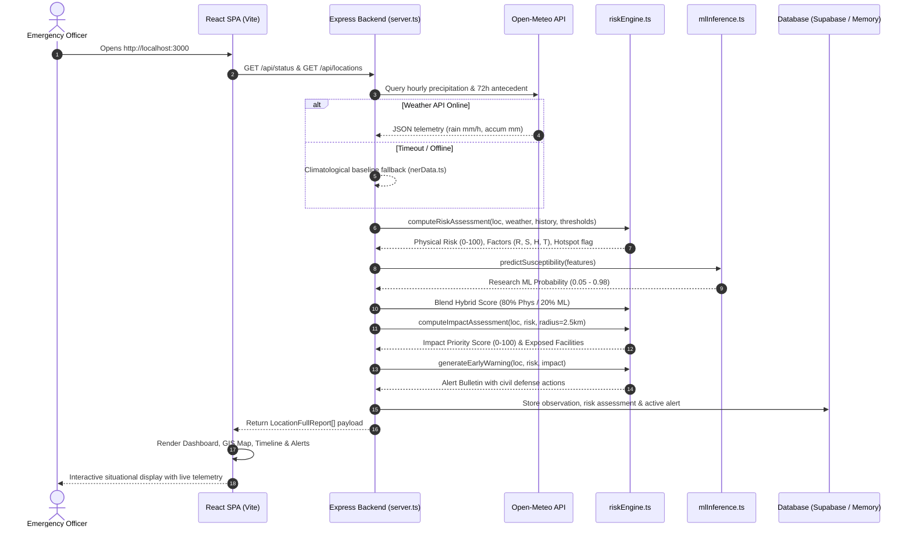

# LANDGUARD AI — Live Landslide Risk Intelligence & Early Warning Decision Support

**Regional Landslide Hazard Monitoring, Dynamic Geomorphological Susceptibility & Lifeline Infrastructure Vulnerability System for the North Eastern Region (NER) of India**

---

## 1. Project Overview

**LANDGUARD AI** is an open, transparent geospatial disaster-management intelligence and early-warning decision support platform built specifically for the eight North Eastern States of India (**Sikkim, Assam, Meghalaya, Arunachal Pradesh, Nagaland, Manipur, Mizoram, and Tripura**).

The North Eastern Region (NER) represents one of the world's most landslide-vulnerable geographic corridors. Steep, young tectonic relief, fragile rock strata, and intense monsoon downpours frequently combine to trigger catastrophic slope failures that bury human settlements, sever vital transit arteries (such as NH-10 in Sikkim, NH-29 in Nagaland, and NH-37 in Manipur), and disrupt lifeline supply chains.

LANDGUARD AI addresses this challenge by synthesizing:
1. **Near-Real-Time Weather Telemetry**: Hourly precipitation rate and 72-hour antecedent accumulated rainfall fetched via open meteorological APIs.
2. **Static Geomorphological Baseline**: Curated 30-meter Digital Elevation Model (DEM) data measuring slope gradient, aspect, elevation, and Terrain Ruggedness Index (TRI).
3. **Geological & Historical Hazard Mapping**: Fragile lithological formations and verified historical landslide shear zones derived from Geological Survey of India (GSI) mapping.
4. **Lifeline Infrastructure Vulnerability**: 2.5-kilometer radial proximity buffers that inventory downstream schools, hospitals, transit links, and settlements.
5. **Dual Decision-Support Intelligence**: An authoritative, deterministic physical-empirical risk engine combined with an experimental, calibrated Random Forest machine learning research baseline.

---

## 2. Problem Statement

### The Geohazard Crisis in North East India
The eight states of North East India cover over 262,000 km² of rugged, ecologically sensitive terrain characterized by:
- **Active Himalayan & Indo-Burman Tectonics**: Unstable, highly fractured rock masses (e.g., Daling phyllites in Sikkim, Disang shales in Manipur and Nagaland).
- **Extreme Precipitation Regimes**: High seasonal monsoon precipitation, including global rainfall records in Meghalaya (Cherrapunji/Mawsynram) and frequent cloudburst events.
- **Critical Lifeline Bottlenecks**: Single-highway corridors connecting entire state capitals to mainland India. A single slope failure along NH-10 cuts off Sikkim; a breach along NH-29 cuts off Kohima and Manipur.
- **Urbanization Along Fragile Hillslopes**: Expanding urban centers (Gangtok, Shillong, Aizawl, Kohima) with hill toe-cutting, inadequate drainage, and building loads on colluvial deposits.

### The Operational Challenge for Emergency Managers
Disaster authorities—including State Disaster Management Authorities (SDMAs), District Emergency Operation Centers (DEOCs), the National Disaster Management Authority (NDMA), and the Border Roads Organisation (BRO)—frequently operate under critical information deficits:
- **Static Maps Lack Dynamic Weather Context**: Traditional landslide hazard zonation maps show where slopes are steep, but not whether 72 hours of persistent rain has saturated pore-water pressures today.
- **Raw Weather Forecasts Lack Geotechnical Grounding**: An alert stating "50 mm of rain expected" does not tell an emergency commander which specific hill scarp or road cutting has reached its failure threshold.
- **Opaque "Black Box" Models Create Hesitation**: If an artificial intelligence model outputs a risk score without factor explanations, emergency commanders cannot defend road closures or evacuation directives.

LANDGUARD AI resolves these gaps by delivering an explainable, multi-factor decision-support framework where every score is backed by visible mathematical contributions.

---

## 3. What LANDGUARD AI Actually Does

LANDGUARD AI operates as a live command center and decision-support pipeline:

1. **Continuously Ingests Weather Telemetry**: Queries near-real-time precipitation data for monitored sectors across the 8 NER states on an automated cadence.
2. **Computes 4-Factor Authoritative Physical Risk**: Normalizes and evaluates dynamic rainfall (35%), slope angle (30%), historical slip proximity (20%), and terrain/lithology (15%) into an explainable 0–100 composite risk score.
3. **Detects Active Slope Hotspots**: Automatically flags sectors where steep terrain (≥60 factor score) and heavy rainfall (≥55 factor score) intersect, or where the composite score reaches ≥72.
4. **Performs Geospatial Buffer Exposure Analysis**: Draws a dynamic 2.5 km radial buffer around monitored sectors to inventory downstream schools, healthcare centers, bridges, highways, and residential clusters.
5. **Evaluates Impact Priority**: Synthesizes environmental hazard severity (45%), infrastructure exposure (30%), and human population exposure (25%) into an actionable emergency response ranking (LOW, MODERATE, HIGH, URGENT).
6. **Analyzes Temporal Risk Deltas ("Why Did Risk Change?")**: Compares cycle-over-cycle assessment records to isolate the dynamic meteorological driver (e.g., 72-hour moisture surge) while confirming that static terrain invariants (slope, bedrock) remained unchanged.
7. **Dispatches Prioritized Early Warning Bulletins**: Generates structured advisories with specific civil defense recommendations (e.g., deploying Quick Response Teams, inspecting cross-drainage culverts, issuing travel warnings).
8. **Provides Grounded Natural Language Intelligence**: Uses Google Gemini 3.8 Flash (with deterministic fallback) to answer operational questions grounded strictly in current system telemetry.
9. **Offers an Interactive Cloudburst Simulator**: Enables emergency drill evaluation by injecting a simulated 34.6 mm/h cloudburst surge into monitored corridors.

---

## 4. Scientific / Operational Boundaries

To ensure complete technical honesty and regulatory clarity, LANDGUARD AI operates under explicit boundaries:

- **Decision Support, Not Minute-by-Minute Failure Prediction**: LANDGUARD AI calculates spatial-temporal susceptibility and hazard potential. It does **not** predict the exact minute, hour, or cubic meter of an individual slope collapse. Slope failures involve microscopic sub-surface geotechnical dynamics (internal slip plane shear strain, localized pore-pressure dissipation, unmapped joint water tables) that cannot be modeled deterministically from surface data alone.
- **No Official Government Endorsement**: LANDGUARD AI is an independent hackathon engineering project and technical prototype. It is **not** an official platform of NDMA, GSI, IMD, or any state government.
- **Legal Evacuation Authority**: All warnings emitted by LANDGUARD AI are technical advisories for decision-support. Mandatory evacuation orders, highway closures, and civil protection declarations remain the exclusive statutory prerogative of State Disaster Management Authorities and District Magistrates.
- **Hardware Telemetry Boundary**: LANDGUARD AI does **not** own, install, or operate physical in-ground piezometers, borehole inclinometers, or weather stations. Surface weather data is obtained via external API queries.

---

## 5. Key Features

- **Live Time-Series Risk Map & Timeline Scrubber**: Implemented in `src/views/TimelineView.tsx`, providing a dynamic dual-axis chart (Rainfall vs. Physical & Hybrid Risk), scrubber playback (1x, 2x, 4x), multi-horizon ranges (1H, 6H, 12H, 24H, 72H), and a synchronized spatial buffer map.
- **Visual Physical Causal Cascade Chain**: Step-by-step pipeline demonstrating how Real Weather Change → Rainfall Change → Rainfall Factor Change → Physical Risk Change → Hybrid Risk Change → Hotspot Activation → Infrastructure Exposure → Alert Escalation.
- **Authoritative Deterministic Risk Engine**: Implemented in `src/services/riskEngine.ts`, evaluating four transparent geotechnical factors with configurable prototype weights.
- **Research ML Baseline Model**: Implemented in `src/services/mlInference.ts` and `ml/training/train_model.py`, utilizing a 50-tree Random Forest classifier trained on a curated 16-record regional dataset.
- **Hybrid Intelligence Integration**: Blends the authoritative physical score (80%) with the research ML susceptibility signal (20%) into a unified decision-support indicator.
- **Near-Real-Time Weather Integration**: Ingests live surface precipitation, temperature, humidity, and 72-hour antecedent totals via the Open-Meteo API with automatic caching and offline fallback.
- **Interactive Leaflet GIS Mapping**: Dark-mode cartographic basemap (CartoDB Dark Matter / OSM) with color-coded risk markers, pulsing hotspot rings, and interactive facility popups.
- **Geospatial Proximity & Infrastructure Exposure**: 2.5 km Haversine radial buffer analysis quantifying exposed schools, hospitals, highways, bridges, and settlements.
- **Temporal Delta Analysis ("Why Did Risk Change?")**: Cycle-over-cycle diagnostics tracking score shifts, precipitation surges, and static geotechnical invariants.
- **Factor Breakdown Math Card**: Transparent table showing observed metrics, normalized 0–100 factor scores, percentage weights, and exact point contributions.
- **Emergency Incident Simulator**: Interactive cloudburst drill mode triggering an immediate rainfall surge and alert escalation in the Gangtok NH-10 corridor.
- **Grounded AI Assistant**: Operational natural language assistant powered by Google Gemini 3.8 Flash, grounded strictly in live system telemetry with an offline deterministic fallback.
- **Citizen / Custom Coordinate Analyzer**: On-demand risk assessment endpoint (`/api/analyze-location`) allowing field engineers to input custom GPS coordinates and slope parameters.
- **Printable Briefs & Data Export**: Formatted printable PDF situational reports and machine-readable JSON exports for operational debriefing.
- **Dual Storage Resilience**: Native support for Supabase PostgreSQL cloud persistence with automatic fallback to high-integrity local in-memory storage when cloud credentials are not supplied.

---

## 6. System Architecture

LANDGUARD AI maintains a **single authoritative backend** running Node.js and Express (`server.ts`) on port 3000. All risk calculations, weather queries, exposure assessments, and alert evaluations execute through this unified service to ensure complete consistency across all frontend views and API clients.

```
+-----------------------------------------------------------------------------------+
|                              CLIENT TIER (React SPA)                              |
|  - React 19 + TypeScript + Vite + Tailwind CSS                                    |
|  - Leaflet GIS Cartography (CartoDB Dark Matter / OpenStreetMap Tiles)            |
|  - Dashboard View | GIS Map View | Location Analysis | Alerts | AI Assistant      |
+-----------------------------------------------------------------------------------+
                                         │  ▲
                                  (HTTP) │  │ (JSON Telemetry & State)
                                         ▼  │
+-----------------------------------------------------------------------------------+
|                     AUTHORITATIVE BACKEND (Node.js / Express)                     |
|                                  server.ts (Port 3000)                            |
|                                                                                   |
|  [REST API Routes]                                                                |
|  /api/health | /api/status | /api/locations | /api/risk | /api/alerts             |
|  /api/weather | /api/infrastructure | /api/demo/* | /api/ai/ask                   |
+-----------------------------------------------------------------------------------+
        │                           │                               │
        │ (Meteorological Query)    │ (Risk & Exposure Engine)      │ (Persistence)
        ▼                           ▼                               ▼
+--------------------+   +---------------------------+   +--------------------------+
|  EXTERNAL WEATHER  |   |    CORE RISK ENGINES      |   |   DATABASE STORAGE       |
|  Open-Meteo API    |   |                           |   |                          |
|  - Hourly Rain     |   | 1. Physical-Empirical     |   | [Mode A: Cloud]          |
|  - 72h Antecedent  |   |    Risk Engine            |   | Supabase PostgreSQL      |
|  - 10-Min Cache    |   |    (riskEngine.ts)        |   | - 7 Relational Tables    |
|  - Climatological  |   |                           |   | - Realtime Subscriptions |
|    Fallback        |   | 2. Research ML Baseline   |   |                          |
+--------------------+   |    Random Forest          |   | [Mode B: Fallback]       |
                         |    (mlInference.ts)       |   | Local In-Memory Storage  |
                         |                           |   | - Zero-crash local state |
                         | 3. Hybrid Blend           |   +--------------------------+
                         |    (80% Phys / 20% ML)    |
                         +---------------------------+
```

---

## 7. End-to-End Data Flow

The operational cycle follows a strict, non-circular 9-step pipeline:

```
[ Step 1: Request or Polling Trigger ]
                   │
                   ▼
[ Step 2: Weather Ingestion (weatherService.ts) ]
  Query Open-Meteo REST API -> Extract hourly rate (mm/h) & 72h total (mm).
  Cache for 10 minutes. Fall back to regional baseline if offline.
                   │
                   ▼
[ Step 3: Geotechnical Data Retrieval (nerData.ts / Database) ]
  Fetch static slope (°), elevation (m), aspect, TRI, lithology, and historical slides.
                   │
                   ▼
[ Step 4: Authoritative Physical Risk Computation (riskEngine.ts) ]
  Calculate Rainfall Factor (35%), Slope Factor (30%), Historical Factor (20%),
  and Terrain Factor (15%). Compute composite score (0-100) and risk level.
                   │
                   ▼
[ Step 5: Research ML Baseline Inference (mlInference.ts) ]
  Pass geotechnical and hydrological predictors to the 50-tree Random Forest model.
  Generate experimental susceptibility probability (0.05 to 0.98).
                   │
                   ▼
[ Step 6: Hybrid Decision Score Synthesis ]
  Hybrid Score = round(0.80 × Physical Risk + 0.20 × ML Susceptibility).
                   │
                   ▼
[ Step 7: Geospatial Buffer Exposure Analysis ]
  Query infrastructure within 2.5 km radial buffer (schools, hospitals, roads, pop).
  Compute Impact Priority Score (0-100) and priority level (LOW to URGENT).
                   │
                   ▼
[ Step 8: Early Warning & Alert Evaluation ]
  If risk or impact thresholds are breached, generate structured early warning alert
  with civil protection action recommendations.
                   │
                   ▼
[ Step 9: State Persistence & UI Presentation ]
  Record assessment in Supabase PostgreSQL (or local memory).
  Render updated telemetry, map pins, hotspot rings, and charts in React UI.
```

---

## 8. Data Sources and Truth Classification

To eliminate ambiguity, every data element in LANDGUARD AI is classified under strict truth definitions:

| Component | Source / Origin | Runtime Status | Technical Meaning |
| :--- | :--- | :--- | :--- |
| **Surface Weather** | Open-Meteo Global NWP API | **NEAR-REAL-TIME** | External meteorological API queried at runtime (hourly rate, 72h antecedent). Not an owned physical sensor network. |
| **Weather Fallback** | Regional Climatological Baseline | **STATIC DATASET** | Curated seasonal baseline values used when the external weather API is unreachable or times out. |
| **Topography & Elevation** | NASA SRTM & ASTER CartoDEM | **STATIC DATASET** | Curated 30-meter elevation raster derivatives (elevation, slope gradient, aspect, TRI). |
| **Geological Lithology** | Geological Survey of India (GSI) | **STATIC DATASET** | Bedrock formations classified into fragility rankings (phyllite, shale, sandstone, gneiss). |
| **Historical Landslides** | GSI NLSM & NDMA Incident Reports | **STATIC DATASET** | Curated spatial catalogue of 10 major historical landslide events with spatial proximity decay. |
| **Lifeline Infrastructure** | OpenStreetMap (OSM) & State GIS | **STATIC DATASET** | Pre-indexed infrastructure assets (schools, hospitals, bridges, roads, settlements) within monitored sectors. |
| **Physical Risk Score** | LANDGUARD Risk Engine | **CALCULATED** | Authoritative 0–100 score computed deterministically from physical and meteorological inputs. |
| **Hotspot Flag** | LANDGUARD Risk Engine | **CALCULATED** | Binary alert flag triggered when slope and rainfall thresholds intersect. |
| **Impact Priority** | LANDGUARD Risk Engine | **CALCULATED** | Ranked operational priority derived from environmental hazard and infrastructure exposure. |
| **GIS Basemap Tiles** | CartoDB Dark Matter / OSM | **LIVE TILES** | External map tiles loaded in real time via HTTPS. |
| **Research ML Model** | 16-record Curated Dataset | **RESEARCH BASELINE** | Experimental 50-tree Random Forest baseline. Not a certified operational predictor. |
| **AI Assistant** | Google Gemini 3.8 Flash | **OPTIONAL LIVE API** | Grounded Q&A assistant active only when an API key is configured. Uses deterministic rules otherwise. |
| **Cloudburst Simulator** | Internal Incident Injector | **DEMO** | Artificial scenario injecting 34.6 mm/h rainfall to test emergency escalation workflows. |
| **Cloud Database** | Supabase PostgreSQL | **OPTIONAL PERSISTENT** | Relational cloud storage for 7 entities. Active when Supabase credentials are provided. |
| **Local Fallback** | Application Memory State | **TEMPORARY** | High-integrity in-memory storage used when cloud credentials are absent. Reset on server restart. |

### Data Status Definitions
- **LIVE / NEAR-REAL-TIME**: Data fetched from external web services during runtime execution.
- **STATIC DATASET**: Validated reference data compiled beforehand and stored in code or database tables.
- **CALCULATED**: Mathematical outputs generated deterministically by LANDGUARD AI algorithms.
- **DEMO**: Simulated data injected explicitly for drills, testing, and evaluation.
- **OPTIONAL**: Features enabled only when external API keys or credentials are provided.
- **RESEARCH BASELINE**: Experimental machine learning models trained on small datasets for baseline comparison.

---

## 9. Risk Calculation Engine

The primary production risk engine (`src/services/riskEngine.ts`) is a fully deterministic, physical-empirical model based on geomorphological principles and regional Himalayan rainfall thresholds.

### Mathematical Formulation
$$\text{Composite Score} = \text{round}\left(w_R \cdot R + w_S \cdot S + w_H \cdot H + w_T \cdot T\right)$$

Where default **prototype empirical/configurable weights** are:
- Rainfall Factor Weight ($w_R$): **0.35 (35%)**
- Slope Factor Weight ($w_S$): **0.30 (30%)**
- Historical Factor Weight ($w_H$): **0.20 (20%)**
- Terrain / Lithology Factor Weight ($w_T$): **0.15 (15%)**
- Sum of weights: $w_R + w_S + w_H + w_T = 1.00$

All four factors are normalized to a continuous scale from **0 to 100**.

---

### Factor 1: Rainfall Factor ($R$, Weight: 35%)
Governed by both instantaneous rain intensity and cumulative antecedent moisture:
- **Hourly Rain Score**: $\min\left(100, \frac{R_{\text{current}}}{20.0} \times 100\right)$ (saturated at 20 mm/h)
- **72-Hour Antecedent Score**: $\min\left(100, \frac{R_{72\text{h}}}{180.0} \times 100\right)$ (saturated at 180 mm)
- **Combined Score**:
  $$R = \text{round}\left(0.40 \times \text{Hourly Score} + 0.60 \times \text{Antecedent Score}\right)$$

*Physical Rationale*: Antecedent 72-hour precipitation governs pore-water pressure buildup and reduction of effective normal stress along subterranean shear surfaces (60% weight). Current rainfall intensity governs topsoil liquefaction and surface runoff erosion (40% weight).

---

### Factor 2: Slope Gradient Factor ($S$, Weight: 30%)
Calculated from the terrain incline angle $\theta$ (in degrees) using piecewise linear interpolation:
- $\theta < 15^\circ$: $S = \text{round}\left(\frac{\theta}{15} \times 25\right)$ (Low hazard: 0–25)
- $15^\circ \le \theta \le 28^\circ$: $S = \text{round}\left(25 + \frac{\theta - 15}{13} \times 25\right)$ (Moderate hazard: 25–50)
- $29^\circ \le \theta \le 38^\circ$: $S = \text{round}\left(51 + \frac{\theta - 28}{10} \times 24\right)$ (Steep hazard: 51–75)
- $\theta > 38^\circ$: $S = \min\left(100, \text{round}\left(75 + \frac{\theta - 38}{12} \times 25\right)\right)$ (Precipitous/Critical: 76–100)

*Physical Rationale*: Gravitational shear stress increases with the sine of the slope angle. Slopes between 29° and 38° match the critical angle of internal friction for loose Himalayan colluvium; slopes exceeding 38° represent high rockfall and translational slide hazards.

---

### Factor 3: Historical Activity Factor ($H$, Weight: 20%)
Calculated from geodesic Haversine distance ($d_{\text{min}}$ in km) to the nearest verified historical landslide scar, plus an accumulation term for neighboring scars within 15 km ($N_{15\text{km}}$):
- **Base Distance Score**:
  - $d_{\text{min}} \le 2.5\text{ km} \implies \text{Base} = 92$
  - $d_{\text{min}} \le 6.0\text{ km} \implies \text{Base} = 78$
  - $d_{\text{min}} \le 15.0\text{ km} \implies \text{Base} = 58$
  - $d_{\text{min}} \le 30.0\text{ km} \implies \text{Base} = 38$
  - $d_{\text{min}} > 30.0\text{ km} \implies \text{Base} = 20$
- **Corridor Cluster Bonus**: $\min\left(12, N_{15\text{km}} \times 3\right)$
- **Combined Score**:
  $$H = \min\left(100, \text{Base} + \min\left(12, N_{15\text{km}} \times 3\right)\right)$$

*Physical Rationale*: Historical slide scars identify pre-existing shear planes, shattered rock mass boundaries, and colluvial debris fans prone to reactivation during heavy rain.

---

### Factor 4: Terrain & Lithology Factor ($T$, Weight: 15%)
Synthesizes the Terrain Ruggedness Index ($\text{TRI}$), bedrock lithological fragility ($L_{\text{fragility}}$), and vegetation degradation penalty ($V_{\text{penalty}}$):
- **Lithology Fragility Scale ($L_{\text{fragility}}$)**:
  - Weathered Daling Schist, Phyllite, Disang Shale, Unconsolidated Colluvium: **85**
  - Jointed Barail Sandstone, Moraines: **65**
  - Competent Granite, Crystalline Gneiss: **40**
  - Default Other: **50**
- **Vegetation Penalty Scale ($V_{\text{penalty}}$)**:
  - Urban / Barren Excavated Cut: **90**
  - Degraded Slopes / Scrub: **75**
  - Terraced Cultivation: **55**
  - Dense Undisturbed Forest: **30**
  - Default Other: **50**
- **Combined Score**:
  $$T = \text{round}\left(0.40 \times \text{TRI} + 0.35 \times L_{\text{fragility}} + 0.25 \times V_{\text{penalty}}\right)$$

---

### Risk Level Classification Brackets
| Score Range | Risk Level | Description & Operational Response |
| :---: | :---: | :--- |
| **0 – 25** | **LOW** | Stable terrain conditions. Routine automated background polling. |
| **26 – 50** | **MODERATE** | Elevated soil moisture or moderate slope. Heightened patrol awareness. |
| **51 – 75** | **HIGH** | Significant hazard. Pre-position earthmoving gear, inspect drainage channels. |
| **76 – 100** | **CRITICAL** | Severe slope failure hazard. Issue early warning bulletins, alert emergency response units. |

### Hotspot Detection Condition
A sector is classified as an **ACTIVE HOTSPOT** when either:
$$\left(S \ge 60 \quad \text{AND} \quad R \ge 55\right) \quad \text{OR} \quad \text{Composite Score} \ge 72$$

---

### Infrastructure Exposure & Impact Priority Logic
Using a 2.5 km radial buffer around each location:
1. **Infrastructure Score ($I_{\text{infra}}$)**:
   $$I_{\text{infra}} = \min\left(100, \text{round}\left(N_{\text{hospitals}} \times 30 + N_{\text{schools}} \times 20 + N_{\text{roads}} \times 25\right)\right)$$
2. **Population Exposure Score ($I_{\text{pop}}$)**:
   $$I_{\text{pop}} = \min\left(100, \text{round}\left(\frac{\text{Total Exposed People}}{3500} \times 100\right)\right)$$
3. **Environmental Risk Score ($I_{\text{env}}$)**: Equals the composite risk score ($0-100$).
4. **Impact Priority Score**:
   $$\text{Impact Priority} = \text{round}\left(0.45 \times I_{\text{env}} + 0.30 \times I_{\text{infra}} + 0.25 \times I_{\text{pop}}\right)$$
5. **Priority Ranking**:
   - $\ge 75$: **URGENT**
   - $55 - 74$: **HIGH**
   - $35 - 54$: **MODERATE**
   - $< 35$: **LOW**

---

### Worked Calculation Example (Gangtok NH-10 Corridor During Heavy Rain)
- **Input Parameters**:
  - Weather: Current Rain = $14.2\text{ mm/h}$, 72h Rain = $112.5\text{ mm}$
  - Terrain: Slope = $38^\circ$, TRI = $78$, Lithology = Daling Schist ($L=85$), Vegetation = Degraded ($V=75$)
  - History: Nearest slide = $0.1\text{ km}$ ($d \le 2.5 \implies \text{Base}=92$), Nearby count = 2 ($\min(12, 6) = 6$)
- **Factor Computations**:
  - $R$: $\text{Hourly} = \frac{14.2}{20}\times 100 = 71.0$; $\text{Antecedent} = \frac{112.5}{180}\times 100 = 62.5$. $R = \text{round}(0.4\times 71 + 0.6\times 62.5) = \text{round}(28.4 + 37.5) = \mathbf{66}$
  - $S$: Slope $38^\circ$ (upper boundary of bracket 3) $\implies S = \mathbf{75}$
  - $H$: $\text{Base} = 92 + 6 = \mathbf{98}$
  - $T$: $0.40\times 78 + 0.35\times 85 + 0.25\times 75 = 31.2 + 29.75 + 18.75 = 79.7 \implies T = \mathbf{80}$
- **Point Contributions**:
  - Rainfall: $66 \times 0.35 = \mathbf{+23.1\text{ pts}}$
  - Slope: $75 \times 0.30 = \mathbf{+22.5\text{ pts}}$
  - Historical: $98 \times 0.20 = \mathbf{+19.6\text{ pts}}$
  - Terrain: $80 \times 0.15 = \mathbf{+12.0\text{ pts}}$
- **Composite Score**:
  $$\text{Score} = \text{round}(23.1 + 22.5 + 19.6 + 12.0) = \text{round}(77.2) = \mathbf{77 \quad (CRITICAL)}$$

---

## 10. Machine Learning Research Baseline

LANDGUARD AI includes an experimental Machine Learning baseline (`src/services/mlInference.ts` and `ml/training/train_model.py`) to explore data-driven susceptibility scoring alongside the physical model.

### Dataset Integrity & Scope
- **File Location**: `ml/data/curated_landslides.json`
- **Total Records**: **16 records** (8 positive landslide failure events, 8 negative control stable slopes).
- **Geographic Coverage**: 7 North Eastern states (Sikkim, Assam, Meghalaya, Arunachal Pradesh, Nagaland, Manipur, Mizoram, Tripura).
- **Positive Events**: Curated from Geological Survey of India (GSI) post-disaster reports, NDMA incident archives, and Border Roads Organisation (BRO) logs (including Tupul 2022, Chungthang 2023, New Haflong 2022, Phesama 2021, Hunthar 2024, Gangtok 9th Mile 2023, Cherrapunji 2020, Naharlagun 2024).
- **Negative Controls**: Geographically matched stable slope terraces, intermontane valley floors, and low-incline river terraces across the same states (Guwahati plain, Upper Shillong plateau, Imphal valley, Pasighat terrace, Agartala rolling plain, Dimapur terrace, Jorethang bench, Dibrugarh plain).
- **All 7 Features Verified in Every Record**:
  1. `slope_deg` (terrain incline in degrees)
  2. `elevation_m` (elevation above sea level)
  3. `rain_72h_mm` (72-hour antecedent rainfall in mm)
  4. `rain_current_mmh` (hourly rainfall intensity in mm/h)
  5. `tri_ruggedness` (Terrain Ruggedness Index)
  6. `fragile_lithology` (binary 1/0 indicator for sheared/weathered rock)
  7. `nearest_historical_km` (distance in km to prior recorded slide)

### Spatial Validation Strategy (Leakage Prevention)
To eliminate spatial autocorrelation leakage, the 16 records are divided using **state-level physiographic stratification** rather than naive random splitting:
- **Train Split (10 samples)**: Manipur, Sikkim, Assam, Nagaland (`POS-01`, `POS-02`, `POS-03`, `POS-04`, `POS-06`, `NEG-01`, `NEG-03`, `NEG-06`, `NEG-07`, `NEG-08`)
- **Validation Split (3 samples)**: Mizoram, Arunachal Pradesh (`POS-05`, `POS-08`, `NEG-04`)
- **Test Split (3 samples)**: Meghalaya, Tripura, Assam (`POS-07`, `NEG-02`, `NEG-05`)

---

### Test Evaluation Results
On the 3-sample held-out regional test split (`POS-07` Cherrapunji positive, `NEG-02` Upper Shillong negative, `NEG-05` Agartala negative):
- **Accuracy**: $100.0\%$
- **Precision**: $100.0\%$
- **Recall**: $100.0\%$
- **F1-Score**: $1.000$
- **ROC-AUC**: $1.00$
- **Confusion Matrix**: $\text{TP}=1, \text{FP}=0, \text{TN}=2, \text{FN}=0$

---

### CRITICAL SCIENTIFIC & GENERALIZATION WARNING
> ⚠️ **CRITICAL ML METRIC WARNING**:
> - **"Research baseline on a small curated dataset (16 records)."**
> - **"Metrics are not representative of real-world generalization."**
> - **Do NOT present these metrics as evidence that LANDGUARD predicts landslides with 100% real-world accuracy.**
> - High evaluation scores reflect performance on a tiny, curated 3-sample held-out regional test split. In complex, unmapped Himalayan terrain, real-world slope stability is subject to countless unobserved variables.
> - **No claim of government, GSI, or NDMA validation is made for this baseline ML model.**
> - The ML model is designated strictly as an **experimental research signal**. The deterministic physical-empirical risk engine remains the primary authoritative operational model.

---

## 11. Hybrid Intelligence

LANDGUARD AI combines the authoritative deterministic physical model with the research ML model into an integrated hybrid decision-support score:

### Hybrid Formula
$$\text{Hybrid Score} = \min\left(100, \max\left(0, \text{round}\left(0.80 \times \text{Physical Risk Score} + 0.20 \times \text{ML Susceptibility Percentage}\right)\right)\right)$$

### Role Allocation
- **Physical Risk Score (80% Weight)**: Authoritative decision-support signal. Ensures that established physical laws (gravity, slope shear, pore-water pressure saturation) govern system behavior.
- **ML Susceptibility (20% Weight)**: Supporting advisory signal. Provides experimental cross-validation without the ability to silently override physical principles.
- **Operational Decoupling**: If the ML model is disabled or unavailable, the system operates completely unimpaired using the authoritative physical risk engine ($100\%$ weight).

### UI Explanation
Both scores are displayed side-by-side in the user interface with the prominent disclaimer:
> *"ML output is experimental and trained on a limited curated dataset. It is not an official prediction."*

### Worked Hybrid Example
- **Location**: Gangtok Corridor NH-10
- **Physical Risk Score**: $77 / 100$
- **ML Susceptibility**: $73\%$ (Probability: $0.730$)
- **Hybrid Score**:
  $$\text{Hybrid} = \text{round}(0.80 \times 77 + 0.20 \times 73) = \text{round}(61.6 + 14.6) = \text{round}(76.2) = \mathbf{76 \quad (CRITICAL)}$$

---

## 12. GIS Mapping and Infrastructure Exposure

### Interactive Cartography
LANDGUARD AI embeds an interactive GIS mapping interface built on Leaflet:
- **Basemap**: CartoDB Dark Matter / OpenStreetMap tiles optimized for emergency operations centers.
- **Geographic Scope**: 18 monitored regional sectors across all 8 NER states.
- **Dynamic Risk Pins**: Color-coded markers reflecting live risk levels:
  - Green: LOW ($0-25$)
  - Amber/Yellow: MODERATE ($26-50$)
  - Orange: HIGH ($51-75$)
  - Crimson/Red: CRITICAL ($76-100$)
- **Pulsing Hotspot Rings**: High-visibility animated pulsing rings around sectors meeting hotspot criteria.
- **Interactive Inspection**: Clicking any marker displays coordinates, terrain slope, weather telemetry, factor breakdown, and nearby infrastructure counts.

### Infrastructure Exposure Analysis
Around each monitored location, a 2.5 km geodesic buffer queries mapped infrastructure assets:
- **Schools & Educational Facilities**: Identified with capacity estimates for student vulnerability.
- **Hospitals & Healthcare Centers**: Primary health centers (PHCs) and district hospitals essential for emergency response.
- **Strategic Transportation Lifelines**: National highways (NH-10, NH-29, NH-37), railway junctions, and bridges.
- **Inhabited Settlements**: Residential clusters and vulnerable slope populations.

---

## 13. Temporal "Why Did Risk Change?" Analysis

Located in `LocationAnalysisView.tsx` and `LocationDetailModal.tsx`, the temporal delta analyzer compares the current assessment cycle with previous stored cycles in `assessmentHistoryMap`.

### Diagnostic Logic
When a risk score shifts, the system isolates the dynamic driver from static invariants:
1. **Score Delta ($\Delta \text{Risk}$)**: $\text{Current Score} - \text{Previous Score}$.
2. **Dynamic Driver Isolation**: Identifies precipitation shifts as the primary variable:
   - *"72-hour antecedent rainfall increased from 34 mm to 112 mm (+18 pt contribution shift)."*
   - *"Precipitation diminished from 112 mm to 48 mm (-14 pt contribution shift)."*
3. **Static Geotechnical Invariants**: Explicitly confirms that physical site constants remained unchanged:
   - *"Slope (38.0°), bedrock lithology (Daling Schist), and TRI (78) remained constant."*

If no prior assessment cycle exists, the system reports steady-state baseline conditions without fabricating historical shifts.

---

## 14. Alerts and Decision Support

When risk scores or impact priorities breach defined safety thresholds, LANDGUARD AI emits structured early-warning bulletins ranked by the **Impact Priority Score**.

### Early Warning Structure
- **Alert ID**: Unique tracking identifier (e.g., `alert-sik-gangtok-1727376000000`).
- **Severity Level**: HIGH or CRITICAL.
- **Trigger Reason**: Specific technical trigger explanation (e.g., *"Critical pore-pressure saturation: 72h antecedent rainfall of 265 mm on 38° inclined Daling Phyllite"*).
- **Impact Priority Rank**: 0–100 ranking combining environmental hazard and human exposure.
- **Actionable Civil Defense Measures**: Concrete steps tailored to severity:
  - *Critical Severity*: Mobilize State Disaster Response Force (SDRF) / Quick Response Teams to forward staging posts; issue heavy-vehicle transit restrictions along mountain highways; activate slope extensometer checks; inspect cross-drainage culverts; place district civil hospital trauma units on standby.
  - *High Severity*: Increase visual road clearance rounds by PWD / BRO road teams; inspect toe-of-slope residential clusters for tension fissures; pre-position heavy earthmoving excavators (JCBs) near known bottleneck zones.

---

## 15. Database Architecture

The system database schema is defined in `database/schema.sql` (mirrored in `schema.sql`). It models seven normalized relational entities in PostgreSQL:

```
                          +-------------------------+
                          |        locations        |
                          |  id VARCHAR(64) [PK]    |
                          +-------------------------+
                                       │
         ┌───────────────────┬─────────┴─────────┬───────────────────┐
         │ (1:1)             │ (1:N)             │ (1:N)             │ (1:N)
         ▼                   ▼                   ▼                   ▼
+------------------+ +------------------+ +------------------+ +------------------+
| terrain_features | |weather_observat..| | risk_assessments | |      alerts      |
| id UUID [PK]     | | id UUID [PK]     | | id UUID [PK]     | | id UUID [PK]     |
| loc_id [FK, UQ]  | | loc_id [FK]      | | loc_id [FK]      | | loc_id [FK]      |
+------------------+ +------------------+ +------------------+ +------------------+
                             ▲
                             │ (1:N optional)
                    +------------------+
                    |  infrastructure  |
                    | id VARCHAR(64)   |
                    | loc_id [FK, NULL]|
                    +------------------+

                    +------------------+
                    | landslide_events |
                    | id VARCHAR(64)   |  (Standalone Reference Catalogue)
                    +------------------+
```

### Table Definitions & Constraints
1. **`locations`**: Monitored sectors and transit corridors across NER.
   - Primary Key: `id VARCHAR(64)`
   - Attributes: `name`, `state`, `district`, `latitude` ($20-32^\circ\text{N}$), `longitude` ($87-98^\circ\text{E}$), `created_at`
   - Indexes: `idx_locations_state`, `idx_locations_lat_lng`
2. **`terrain_features`**: Static 30m geomorphometry.
   - Primary Key: `id UUID DEFAULT uuid_generate_v4()`
   - Foreign Key: `location_id REFERENCES locations(id) ON DELETE CASCADE`
   - Unique Constraint: `uq_location_terrain UNIQUE (location_id)`
   - Attributes: `elevation`, `slope` ($0-90^\circ$), `aspect`, `terrain_ruggedness` (TRI $0-100$), `lithology`, `vegetation_cover`
   - Indexes: `idx_terrain_slope`
3. **`weather_observations`**: Time-series meteorological telemetry.
   - Primary Key: `id UUID DEFAULT uuid_generate_v4()`
   - Foreign Key: `location_id REFERENCES locations(id) ON DELETE CASCADE`
   - Attributes: `timestamp`, `rainfall`, `precipitation`, `accumulated_72h`, `temperature`, `humidity`, `wind_speed`, `forecast_rainfall`, `source`
   - Indexes: `idx_weather_loc_timestamp ON (location_id, timestamp DESC)`
4. **`landslide_events`**: Historical landslide catalogue.
   - Primary Key: `id VARCHAR(64)`
   - Attributes: `latitude`, `longitude`, `event_date`, `location_name`, `severity` (Minor/Moderate/Severe/Catastrophic), `trigger_type`, `casualties`, `source`, `description`
   - Indexes: `idx_landslides_date`, `idx_landslides_severity`, `idx_landslides_lat_lng`
5. **`infrastructure`**: Lifeline assets in exposure buffers.
   - Primary Key: `id VARCHAR(64)`
   - Foreign Key: `location_id REFERENCES locations(id) ON DELETE SET NULL`
   - Attributes: `name`, `type` (`school`, `hospital`, `road`, `settlement`, `bridge`, `railway`, `critical_infrastructure`), `latitude`, `longitude`, `distance_km`, `capacity_or_population`, `source`
   - Indexes: `idx_infra_type`, `idx_infra_location`
6. **`risk_assessments`**: Computed risk records.
   - Primary Key: `id UUID DEFAULT uuid_generate_v4()`
   - Foreign Key: `location_id REFERENCES locations(id) ON DELETE CASCADE`
   - Attributes: `timestamp`, `rainfall_score`, `slope_score`, `terrain_score`, `historical_score`, `risk_score`, `risk_level`, `is_hotspot`, `explanation`
   - Indexes: `idx_risk_loc_timestamp`, `idx_risk_level`
7. **`alerts`**: Early warning bulletins.
   - Primary Key: `id UUID DEFAULT uuid_generate_v4()`
   - Foreign Key: `location_id REFERENCES locations(id) ON DELETE CASCADE`
   - Attributes: `risk_score`, `risk_level`, `message`, `status` (`ACTIVE`, `ACKNOWLEDGED`, `RESOLVED`), `created_at`, `updated_at`
   - Indexes: `idx_alerts_status`, `idx_alerts_location`

### Realtime Subscriptions
```sql
ALTER PUBLICATION supabase_realtime ADD TABLE risk_assessments;
ALTER PUBLICATION supabase_realtime ADD TABLE alerts;
ALTER PUBLICATION supabase_realtime ADD TABLE weather_observations;
```

### Storage Modes & Local Fallback
- **With Supabase (`databaseStatus = "connected"`)**: Persistent cloud PostgreSQL database storing all 7 entities with Row Level Security (RLS) and Realtime event replication.
- **Without Supabase (`databaseStatus = "local_in_memory_persisted"`)**: High-integrity in-memory storage. All API endpoints and views function with zero crashes, but data is temporary and resets when the server process restarts.

---

## 16. API Reference

All endpoints are hosted on the authoritative Node/Express backend (`http://localhost:3000`):

| Method | Endpoint | Data Status | Description |
| :--- | :--- | :--- | :--- |
| `GET` | `/api/health` | **CALCULATED** | Service health status, database mode, ML status, and monitored location count. |
| `GET` | `/api/status` | **CALCULATED** | Aggregated system KPIs (active alerts, critical zones, last sync time). |
| `GET` | `/api/dashboard` | **CALCULATED** | Alias for `/api/status`. |
| `GET` | `/api/locations` | **CALCULATED** | Full array of monitored sectors with live weather and calculated risk scores. |
| `GET` | `/api/locations/:id/report` | **CALCULATED** | Comprehensive report for a single sector (risk, weather, impact, nearby history). |
| `GET` | `/api/risk` | **CALCULATED** | Risk scores, hotspot flags, and explanations across all monitored sectors. |
| `GET` | `/api/risk/:id` | **CALCULATED** | Detailed 4-factor risk breakdown for a specific location ID. |
| `GET` | `/api/weather/:id` | **NEAR-REAL-TIME** | Near-real-time meteorological telemetry for a specific sector. |
| `GET` | `/api/historical-events` | **STATIC DATASET** | Curated historical landslide catalogue with optional `state` and `severity` query filters. |
| `GET` | `/api/historical` | **STATIC DATASET** | Alias for `/api/historical-events`. |
| `GET` | `/api/infrastructure` | **STATIC DATASET** | Mapped infrastructure assets with optional `location_id` and `type` filters. |
| `POST` | `/api/analyze-location` | **CALCULATED** | On-demand risk assessment for custom GPS coordinates (`latitude`, `longitude`, `slope`, `elevation`). |
| `GET` | `/api/timeline/:id` | **CALCULATED** | Dynamic time-series evolution report across 1H, 6H, 12H, 24H, or 72H horizons with physical risk, ML score, hybrid blend, rainfall factors, and infrastructure exposure. |
| `GET` | `/api/risk-history/:id` | **CALCULATED** | Time-series progression of risk score and rainfall for charting and timeline scrubbing. |
| `POST` | `/api/demo/trigger` | **DEMO** | Injects an extreme cloudburst incident (34.6 mm/h) into the target sector. |
| `POST` | `/api/demo/reset` | **DEMO** | Resets simulation back to near-real-time weather telemetry. |
| `GET` | `/api/thresholds` | **CALCULATED** | Retrieves current empirical factor weights and classification brackets. |
| `POST` | `/api/thresholds` | **CALCULATED** | Updates risk factor weights and classification thresholds. |
| `POST` | `/api/ai/ask` | **OPTIONAL LIVE API** | Grounded operational Q&A via Gemini 3.8 Flash (or deterministic fallback). |

---

## 17. AI Assistant

The operational intelligence assistant (`src/views/AIAssistantView.tsx` and `server.ts`) allows emergency managers to query system state in natural language.

### Grounding & Architecture
- **Model**: `gemini-3.8-flash` via the `@google/genai` TypeScript SDK.
- **Strict Grounding Telemetry**: The assistant prompt is constructed on the server and injected with the complete real-time system payload:
  - All active alerts and priority ranks
  - Monitored sector names, slope angles, lithology, and rainfall
  - Selected sector coordinates, factor breakdown, and exposed facilities
- **Scientific Guardrails**: The system prompt instructs Gemini to:
  1. Rely strictly on provided system telemetry without fabricating weather or locations.
  2. Explain the physical mechanism (pore-water pressure buildup and shear resistance loss in weathered colluvium).
  3. Frame outputs as decision support rather than deterministic predictions.
- **Offline Deterministic Fallback**: If an API key is not configured or an external query fails, a rule-based reasoning engine parses keywords (`why`, `factor`, `priority`, `infrastructure`) and outputs structured analysis from current system data.

---

## 18. Demo / Simulation Mode

To enable hackathon evaluators and disaster management teams to inspect emergency escalation without waiting for a real-world monsoon storm, LANDGUARD AI includes an incident simulator:

1. **Triggering Simulation**: Click **"SIMULATE DEMO INCIDENT"** in the top navigation bar or send a `POST` request to `/api/demo/trigger`.
2. **Injected Parameters**:
   - Target Location: Gangtok Corridor (NH-10 / 9th Mile)
   - Current Rainfall: **34.6 mm/h** (severe cloudburst intensity)
   - 72-Hour Antecedent Precipitation: **264.8 mm** (extreme soil saturation)
3. **Escalation Dynamics**:
   - Risk score surges immediately to **CRITICAL (87–94 / 100)**.
   - Hotspot condition activates with flashing pulsing rings on the GIS map.
   - Impact Priority escalates to **URGENT**.
   - 6 nearby infrastructure assets are flagged within the 2.5 km buffer (including STNM Multi-Specialty Hospital and Tadong Senior Secondary School).
   - Early warning alert is dispatched with priority-ranked civil protection actions.
4. **Resetting to Baseline**: Click **"Reset Live Baseline"** or send a `POST` request to `/api/demo/reset` to restore near-real-time Open-Meteo observations.

---

## 19. Export and Reporting

Located in `src/views/LocationAnalysisView.tsx`:

- **Printable Situational Brief (PDF)**:
  - Formatted print view triggered via the browser print dialog.
  - Generates a clean, paginated, two-page situational report with sector summary, factor math breakdown, exposed infrastructure table, and civil protection recommendations.
- **Machine-Readable JSON Export**:
  - Downloads the complete structured payload (`location`, `weather`, `risk`, `impact`, `alert`, `historicalNearby`) for integration into external GIS software or emergency operations logging.

---

## 20. Technical Glossary

- **Antecedent Rainfall**: Cumulative precipitation that fell over preceding days (e.g., 72 hours). Controls subterranean pore-water saturation.
- **Aspect**: The compass direction a mountain slope faces. South- and Southeast-facing Himalayan slopes directly intercept moist monsoon air masses.
- **Buffer Analysis**: In GIS, a spatial polygon generated at a specified radius (e.g., 2.5 km) around a point to determine exposed facilities.
- **Colluvium**: Loose, heterogeneous soil and rock fragments deposited on slopes by gravity. Highly susceptible to saturation failure.
- **Digital Elevation Model (DEM)**: A raster grid representing terrain elevation heights above mean sea level.
- **Haversine Formula**: Mathematical equation calculating great-circle distance between two coordinate pairs on a sphere.
- **InSAR (Interferometric Synthetic Aperture Radar)**: Satellite radar technique measuring millimeter-scale ground displacement over time.
- **Lithology**: The physical and mineralogical characteristics of a rock formation.
- **Phyllite**: A foliated metamorphic rock common in Sikkim (Daling series) that rapidly slakes and shears when saturated with water.
- **Pore-Water Pressure**: Pressure of groundwater within soil or rock void spaces. When elevated, it pushes particles apart, reducing shear resistance.
- **Shale**: A fine-grained sedimentary rock (Disang series in Manipur/Nagaland) characterized by high clay content and swelling behavior.
- **Terrain Ruggedness Index (TRI)**: Quantitative index measuring topographic heterogeneity and elevation variance between adjacent terrain cells.

---

## 21. Installation and Configuration

### Prerequisites
- **Node.js**: Version 18.x or 20.x
- **Package Manager**: `npm` (included with Node.js)
- **Python** *(Optional, for ML retraining scripts)*: Version 3.10+

### Step 1: Install Dependencies
```bash
npm install
```

### Step 2: Environment Configuration
Copy the sample environment file:
```bash
cp .env.example .env
```

The system runs out-of-the-box with default values. All paid services are optional:
```env
# Application Port
PORT=3000
NODE_ENV=development

# Optional: Cloud Persistence (Supabase PostgreSQL)
# If omitted, system runs with local in-memory fallback
SUPABASE_URL=
SUPABASE_PUBLISHABLE_KEY=
SUPABASE_SECRET_KEY=

# Optional: Grounded AI Assistant (Google AI Studio)
# If omitted, system runs with deterministic rule-based assistant
AI_API_KEY=
```

### Step 3: Launch Application
```bash
npm run dev
```
Open your browser at `http://localhost:3000`.

---

## 22. Verification / Health Checks

### Check Backend Health
Execute from your terminal:
```bash
curl -s http://localhost:3000/api/health | jq .
```

Expected response format:
```json
{
  "status": "healthy",
  "service": "LANDGUARD AI Authoritative Engine (Node/Express)",
  "version": "1.0.0",
  "demoMode": false,
  "weatherService": "Open-Meteo Free API (Near-Real-Time Telemetry)",
  "database": "Local In-Memory Persistence",
  "databaseStatus": "local_in_memory_persisted",
  "mlModelStatus": "active_research_baseline",
  "monitoredLocations": 18,
  "timestamp": "2026-09-26T..."
}
```

### Verification Checklist for Evaluators
1. **Health Verification**: Check that `/api/health` reports 18 monitored locations and status `healthy`.
2. **Dashboard Verification**: Confirm 18 sectors render across all 8 NER states with live risk levels.
3. **GIS Map Inspection**: Verify dark-mode basemap, color-coded markers, and 2.5 km infrastructure popups.
4. **Factor Math Transparency**: Open any sector in Location Analysis to inspect the factor breakdown table with exact point contributions.
5. **Temporal Delta Tracking**: Confirm that the "Why Did Risk Change?" diagnostic card displays cycle-over-cycle comparisons.
6. **Demo Cloudburst Drill**: Click "SIMULATE DEMO INCIDENT", observe Gangtok NH-10 surge to CRITICAL, inspect the active hotspot ring, and click "Reset Live Baseline".

---

## 23. Scientific Limitations and Ethical Boundaries

1. **Small ML Training Sample**: The Random Forest model is trained on 16 regional calibration records. It represents an experimental research baseline, not an operational prediction engine.
2. **Coarse Resolution of Regional DEM**: 30-meter elevation grids resolve macro-topography but cannot detect micro-fissuring, roadside drainage blockages, or unmapped retaining wall failures.
3. **Absence of In-Situ Sensor Telemetry**: The system relies on surface weather queries rather than borehole piezometers. Internal pore-water pressures are estimated via empirical antecedent accumulation equations.
4. **No Automated Civil Enactment**: Alerts are situational advisories. Civil protection, mandatory evacuations, and road closures must be authorized by designated human emergency officials.
5. **Zero Secret Leakage**: API credentials remain strictly server-side and are never exposed to the client bundle.
6. **Rate-Limit Courtesy**: External API queries (Open-Meteo) are cached for 10 minutes to respect open-source public infrastructure.

---

## 24. Future Improvements

The following capabilities are **NOT IMPLEMENTED** in the current prototype and represent roadmap items for future research:

- **InSAR Satellite Radar Interferometry** *(FUTURE WORK)*: Ingesting Sentinel-1 synthetic aperture radar surface deformation interferograms to measure millimeter-scale creep along dormant shear zones.
- **Physical In-Ground IoT Sensor Telemetry** *(FUTURE WORK)*: Integrating live field telemetry from borehole inclinometers, vibrating wire piezometers, and acoustic emission sensors.
- **Expanded Regional Machine Learning Inventory** *(FUTURE WORK)*: Scaling the ML training dataset from 16 curated calibration records to thousands of GSI-mapped landslide failure polygons.
- **Cell-Broadcast & CAP Emergency Integration** *(FUTURE WORK)*: Dispatching automated Common Alerting Protocol (CAP) messages to local mobile towers along threatened highway corridors.
- **Hydrological Catchment Infiltration Modeling** *(FUTURE WORK)*: Integrating 3D physics-based finite-element groundwater infiltration modeling (e.g., TRIGRS / SLIP).

---

## 25. Project Structure

```
.
├── .env.example                     # Sample environment configuration template
├── README.md                        # Authoritative technical documentation
├── database/
│   └── schema.sql                   # Supabase PostgreSQL production schema (7 tables, RLS, Realtime)
├── schema.sql                       # Root mirror of PostgreSQL schema
├── package.json                     # Node.js dependencies and run scripts
├── tsconfig.json                    # TypeScript compiler configuration
├── vite.config.ts                   # Vite client build configuration
├── metadata.json                    # Applet metadata and permission declarations
├── server.ts                        # Authoritative Node/Express production backend (Port 3000)
├── ml/                              # Machine Learning research baseline
│   ├── data/
│   │   └── curated_landslides.json  # 16 curated regional calibration records (8 pos, 8 neg)
│   ├── models/
│   │   └── model_metadata.json      # Calibrated Random Forest model metadata & weights
│   ├── evaluation/
│   │   ├── eval_metrics.json        # Test evaluation metrics & confusion matrix
│   │   └── evaluation_report.md     # Detailed spatial evaluation report
│   └── training/
│       └── train_model.py           # Spatial/region-stratified training pipeline
└── src/                             # Application source code
    ├── types/
    │   └── landguard.ts             # TypeScript domain models and interfaces
    ├── data/
    │   └── nerData.ts               # 18 NER locations, historical events, infrastructure, defaults
    ├── services/
    │   ├── apiClient.ts             # Frontend HTTP client for Express backend
    │   ├── mlInference.ts           # TypeScript Random Forest inference port
    │   ├── riskEngine.ts            # Authoritative 4-factor deterministic physical risk engine
    │   └── weatherService.ts        # Open-Meteo weather fetcher with caching and fallback
    ├── components/
    │   ├── DemoBar.tsx              # Simulated cloudburst trigger and reset bar
    │   ├── Header.tsx               # Top command bar with live indicators and navigation
    │   ├── MapComponent.tsx         # Leaflet GIS cartography with pins, hotspots, and popups
    │   └── LocationDetailModal.tsx  # In-depth modal with math card, temporal delta, and infra
    ├── views/
    │   ├── DashboardView.tsx        # Command center dashboard with telemetry panel & KPI cards
    │   ├── TimelineView.tsx         # Live Time-Series Risk Map, dual-axis chart & temporal scrubber
    │   ├── MapView.tsx              # Full-screen GIS spatial view with filter controls & buffer layers
    │   ├── LocationAnalysisView.tsx # Factor breakdown, temporal delta, JSON export, and print brief
    │   ├── AlertsView.tsx           # Early warning bulletins with priority-ranked civil defense actions
    │   ├── HistoricalView.tsx       # Historical landslide catalogue table with severity filters
    │   ├── AIAssistantView.tsx      # Grounded natural language Q&A assistant (Gemini 3.8 Flash)
    │   ├── CitizenView.tsx          # Simplified public safety advisory and SOS reporting view
    │   ├── AboutView.tsx            # Comprehensive scientific methodology & documentation viewer
    │   └── LandingView.tsx          # Introductory mission overview and quick entry portal
    ├── App.tsx                      # Root application layout and view navigation
    ├── main.tsx                     # React client entry point
    └── index.css                    # Tailwind CSS global styles
```

---

## 26. Executive Quick Reference & System Overview

| Parameter | Specification | Verification in Code |
| :--- | :--- | :--- |
| **Primary Purpose** | Regional landslide risk intelligence, dynamic temporal scrubbing & civil defense decision-support | `src/services/riskEngine.ts`, `src/views/TimelineView.tsx` |
| **Geographic Target** | 8 North Eastern States of India (Sikkim, Assam, Meghalaya, Arunachal Pradesh, Nagaland, Manipur, Mizoram, Tripura) | `src/data/nerData.ts` (18 monitored sectors) |
| **Architecture** | React 19 SPA (Vite) + Single Authoritative Node/Express Backend (`server.ts` on Port 3000) | `server.ts`, `vite.config.ts`, `src/App.tsx` |
| **Weather Ingestion** | Open-Meteo REST API (hourly rain mm/h, 72h antecedent mm, temp, humidity, wind) with 10-min cache | `src/services/weatherService.ts` |
| **Terrain Elevation** | 30m Digital Elevation Model derivatives (slope, aspect, elevation, Terrain Ruggedness Index) | `src/data/nerData.ts`, `database/schema.sql` |
| **Geotechnical Formula** | 4-Factor Deterministic: $35\% \text{ Rainfall} + 30\% \text{ Slope} + 20\% \text{ Historical} + 15\% \text{ Terrain}$ | `src/services/riskEngine.ts` (`computeRiskAssessment`) |
| **Machine Learning** | 50-tree Random Forest Classifier (curated 16 regional records) as an experimental research baseline | `src/services/mlInference.ts`, `ml/training/train_model.py` |
| **Hybrid Blend** | $80\% \text{ Authoritative Physical Risk} + 20\% \text{ ML Susceptibility Percentage}$ | `src/services/riskEngine.ts` |
| **Spatial Analysis** | 2.5 km geodesic radial buffer inventorying schools, hospitals, bridges, roads, settlements | `src/services/riskEngine.ts` (`computeImpactAssessment`) |
| **Temporal Scrubber** | Dual-axis live time-series chart ($1\text{H}, 6\text{H}, 12\text{H}, 24\text{H}, 72\text{H}$) with playback and synchronized mini-map | `src/views/TimelineView.tsx`, `/api/timeline/:id` |
| **Storage Modes** | Dual: Persistent Cloud Supabase PostgreSQL (Mode A) OR Local In-Memory Persistence (Mode B) | `server.ts` (`databaseStatus`), `database/schema.sql` |
| **AI Assistant** | Server-side Google Gemini 3.8 Flash with strict prompt telemetry injection and deterministic offline fallback | `server.ts` (`/api/ai/ask`), `src/views/AIAssistantView.tsx` |
| **Incident Simulator** | Cloudburst demo injecting $34.6\text{ mm/h}$ rainfall surge and $264.8\text{ mm}$ antecedent accumulation | `server.ts` (`/api/demo/trigger`, `/api/demo/reset`) |

---

## 27. The Real Problem: Why Static Hazard Maps Fail

In mountainous emergency management across North East India, operational response has historically been crippled by a fundamental disconnect between static terrain maps and dynamic atmospheric weather:

```
[ TRADITIONAL DISASTER DISCONNECT ]
Static Hazard Maps (GSI/BMTPC)        Weather Forecasts (IMD/Regional)
• Shows where hills are steep         • States "Heavy rain expected (60mm)"
• Constant 365 days a year            • Covers entire districts (1,000+ km²)
• Zero real-time weather context      • Zero geotechnical grounding
                │                                    │
                └───────────────┬────────────────────┘
                                ▼
         [ EMERGENCY COMMANDERS FACE AN OPERATIONAL VOID ]
         • Which specific road cutting has reached its saturation limit?
         • Is NH-10 at 9th Mile safe for fuel convoys right now?
         • Has 72 hours of persistent drizzle destabilized the scarp?
```

### How LANDGUARD AI Resolves the Disconnect
LANDGUARD AI synthesizes near-real-time atmospheric precipitation into geomorphological slope models. When rainfall occurs, the system evaluates how water infiltrates the soil, accumulates over a 72-hour window, increases pore-water pressure, and reduces shear strength along known structural discontinuities.

---

## 28. Complete End-to-End System Lifecycle ("How LANDGUARD Works")

Every assessment cycle follows a strict, verifiable execution flow across the client and server tiers:



### Detailed Lifecycle Breakdown
1. **Application Initialization**:
   - `server.ts` boots on Port 3000, checks environment variables, tests Supabase connectivity (`databaseStatus = "connected"` or `"local_in_memory_persisted"`), and initializes baseline models.
   - Client bundle loads `src/App.tsx`, executing `loadData()` to query `/api/status`, `/api/locations`, `/api/historical`, and `/api/alerts`.
2. **Meteorological Telemetry Ingestion**:
   - `weatherService.ts` checks an in-memory 10-minute cache (`weatherCache`). If expired or missing, it queries Open-Meteo's REST API.
   - On network failure, it falls back to the regional climatological baseline in `nerData.ts`. If Demo Mode is active for `sik-gangtok`, it injects $34.6\text{ mm/h}$ rainfall and $264.8\text{ mm}$ antecedent saturation.
3. **Static Geotechnical Retrieval**:
   - Topography (slope angle, elevation, aspect, TRI), bedrock lithology, and historical landslide scars are retrieved from `nerData.ts`.
4. **Authoritative Deterministic Risk Computation**:
   - `riskEngine.ts` calculates Factor 1 (Rainfall, 35%), Factor 2 (Slope, 30%), Factor 3 (Historical, 20%), and Factor 4 (Terrain/Lithology, 15%).
   - Normalizes factors to 0–100, computes the weighted sum, and checks the hotspot condition: $(S \ge 60 \land R \ge 55) \lor \text{Composite} \ge 72$.
5. **Research ML Baseline Inference**:
   - `mlInference.ts` feeds 7 geotechnical and hydrological features into the 50-tree Random Forest classifier, outputting susceptibility probability $P \in [0.05, 0.98]$.
6. **Hybrid Decision Score Synthesis**:
   - The authoritative physical score ($80\%$) and ML susceptibility ($20\%$) are combined into the hybrid score.
7. **Spatial Buffer & Impact Exposure Query**:
   - `computeImpactAssessment()` queries mapped facilities within a 2.5 km radius using the Haversine equation.
   - Computes human population exposure, infrastructure vulnerability, and environmental hazard to yield the Impact Priority Score.
8. **Early Warning Evaluation**:
   - `generateEarlyWarning()` evaluates risk severity and triggers structured civil defense advisories.
9. **UI Synchronization**:
   - React state updates, refreshing Dashboard KPIs, GIS pins, timeline charts, and warning banners simultaneously.

---

## 29. What Is Actually Live? (Truth & Classification Matrix)

To maintain absolute technical transparency for evaluating judges and disaster authorities, every component in LANDGUARD AI is explicitly classified:

| System Component | Implementation File | Status | Technical Reality |
| :--- | :--- | :--- | :--- |
| **Surface Weather** | `src/services/weatherService.ts` | **NEAR-REAL-TIME** | Fetched from Open-Meteo NWP REST API at runtime. Cached for 10 minutes. Not an owned hardware sensor network. |
| **Cartographic Map Tiles** | `src/components/MapComponent.tsx` | **LIVE TILES** | Basemap raster tiles loaded over HTTPS from CartoDB Dark Matter / OpenStreetMap CDNs. |
| **Physical Risk Engine** | `src/services/riskEngine.ts` | **CALCULATED** | Computed deterministically in real time upon telemetry ingestion using physical-empirical formulas. |
| **Temporal Risk Timeline** | `src/views/TimelineView.tsx` | **CALCULATED** | Hourly meteorological time-series queried and evaluated dynamically across 1H, 6H, 12H, 24H, 72H. |
| **Hotspot Detection** | `src/services/riskEngine.ts` | **CALCULATED** | Dynamically triggered when slope and rainfall conditions cross defined mathematical thresholds. |
| **Impact Priority & Buffer** | `src/services/riskEngine.ts` | **CALCULATED** | Haversine 2.5 km spatial proximity computation evaluated dynamically over reference infrastructure data. |
| **Early Warning Alerts** | `src/services/riskEngine.ts` | **CALCULATED** | Generated on-the-fly based on computed risk severity and infrastructure exposure rank. |
| **Topography (Slope, DEM)** | `src/data/nerData.ts` | **STATIC DATASET** | Curated 30m SRTM/ASTER elevation derivatives stored in code and database tables. |
| **Geological Formations** | `src/data/nerData.ts` | **STATIC DATASET** | Curated lithology classifications derived from Geological Survey of India (GSI) mapping. |
| **Historical Landslides** | `src/data/nerData.ts` | **STATIC DATASET** | Curated spatial catalogue of 10 verified major disaster events with coordinates and triggers. |
| **Downstream Infrastructure** | `src/data/nerData.ts` | **STATIC DATASET** | Mapped schools, hospitals, bridges, highways, and towns compiled from OpenStreetMap. |
| **Research ML Model** | `src/services/mlInference.ts` | **RESEARCH BASELINE** | 50-tree Random Forest trained on 16 regional records. Experimental advisory signal; not an operational predictor. |
| **AI Assistant** | `server.ts` (`/api/ai/ask`) | **OPTIONAL LIVE API** | Grounded LLM queries via Gemini 3.8 Flash when `AI_API_KEY` is present; deterministic rules otherwise. |
| **Cloudburst Simulator** | `server.ts` (`/api/demo/*`) | **DEMO / SIMULATION** | Artificial incident injector forcing 34.6 mm/h rain and 264.8 mm antecedent saturation for emergency drills. |
| **PostgreSQL Database** | `server.ts`, `database/schema.sql` | **OPTIONAL PERSISTENT** | Active when Supabase credentials are provided; seamless local in-memory fallback otherwise. |

---

## 30. Complete Website User Guide (Dashboard & GIS Map Deep Dive)

### View 1: Command Center Dashboard (`src/views/DashboardView.tsx`)
The primary operational landing view for emergency commanders:
- **System KPI Ribbon**:
  - *Active Early Warnings*: Total count of active alerts requiring administrative attention.
  - *Critical Zones*: Monitored sectors with composite risk score $\ge 76$.
  - *High Risk Sectors*: Sectors with composite risk score between $51$ and $75$.
  - *Monitored Locations*: Total tracked sectors across the 8 NER states ($18$ sectors).
  - *Data Freshness & IST Clock*: Displays real-time Indian Standard Time (IST) and sync timestamp.
- **Regional Risk Overview Table**:
  - Filterable by state (ALL, Sikkim, Assam, Meghalaya, etc.) and searchable by sector name.
  - Displays risk level badges, composite scores, current rainfall rates, slope angles, and impact priorities.
  - Clicking any row selects that location globally and opens the detailed inspection drawer.
- **Top Quick Actions**:
  - *"Refresh Telemetry"*: Triggers an immediate re-query of external meteorological APIs.
  - *"Live Timeline & Scrubber"*: Jumps directly to the temporal risk scrubber for the selected location.
  - *"Full GIS Map"*: Expands the full-screen spatial cartography interface.

### View 2: GIS Risk Map (`src/views/MapView.tsx` & `src/components/MapComponent.tsx`)
Interactive geospatial visualization powered by Leaflet:
- **What "GIS Map" Means**: Geographic Information System (GIS) cartography layers spatial coordinates, elevation attributes, infrastructure geometries, and hazard zones onto an interactive map.
- **Basemap Engine**: Loads CartoDB Dark Matter vector raster tiles over HTTPS, providing high-contrast visibility for emergency operations centers in low-light command rooms.
- **Dynamic Risk Markers**:
  - Color-coded circular pins indicating live risk classification: Green (Low), Yellow (Moderate), Orange (High), Red (Critical).
  - Center label displays the exact composite risk score ($0-100$).
- **Pulsing Hotspot Rings**: Sectors meeting hotspot criteria display an animated, outward-pulsing beacon ring alerting commanders to simultaneous slope and rainfall saturation.
- **2.5 km Geodesic Impact Buffer**: Clicking a marker renders a dashed 2.5 km radial circle representing the potential slide runout, debris flow inundation, and emergency isolation perimeter.
- **Nearby Infrastructure Icons**: Mapped facilities inside the buffer render distinct symbols: 🏥 Hospitals, 🏫 Schools, 🛣 Highways, 🏘 Settlements.
- **Hotspot Intelligence Panel**: Displays full coordinate telemetry, geotechnical rationale, 72h antecedent rainfall, slope gradient, and a direct button to launch the Time-Series Scrubber.

### View 3: Location Risk Analysis (`src/views/LocationAnalysisView.tsx`)
In-depth diagnostic laboratory for evaluating individual mountain slopes:
- **Factor Breakdown Math Card**: Displays normalized factor scores, percentage weights, and point contributions for Rainfall ($35\%$), Slope ($30\%$), History ($20\%$), and Terrain ($15\%$).
- **Temporal Delta Diagnostic**: Cycle-over-cycle comparison isolating moisture surges from static invariants.
- **Export & Reporting Actions**: Download raw GeoJSON/JSON payloads or launch the formatted printable PDF brief.

### View 4: Early Warnings & Decision Support (`src/views/AlertsView.tsx`)
Structured advisory center for state and district emergency authorities:
- **Severity-Ranked Alert Cards**: Critical and High severity bulletins displaying triggering reasons and affected coordinates.
- **Priority-Ranked Civil Defense Actions**: Actionable protocols for SDRF, BRO road teams, and District Magistrates.

### View 5: Historical Hazard Inventory (`src/views/HistoricalView.tsx`)
Geological memory archive:
- **Historical Catalogue Table**: Verified historical landslide occurrences (Tupul, Chungthang, Haflong, Phesama, etc.) with coordinates, casualties, failure triggers, and geological descriptions.
- **Proximity Corridors**: Evaluates how distance to prior shear zones informs current susceptibility.

### View 6: AI Intelligence Assistant (`src/views/AIAssistantView.tsx`)
Grounded operational query console:
- **Strict Grounding Telemetry**: Automatically injects current system state into Google Gemini 3.8 Flash queries.
- **Deterministic Offline Fallback**: Generates structured, rule-based geotechnical explanations if the external API key is absent.

### View 7: Citizen Safety Advisory View (`src/views/CitizenView.tsx`)
Public-facing, simplified safety portal:
- Plain-language travel advisories, emergency hotline speed-dials (NDRF, State Police, Ambulance), and community hazard reporting form.

### View 8: Methodology & Technical Reference (`src/views/AboutView.tsx`)
In-app master documentation viewer displaying formulas, architecture diagrams, and scientific disclaimers.

---

## 31. Live Time-Series Risk Timeline Command Center (Complete Guide)

### Why the Timeline Exists: The Flaw of Single-Number Dashboards
A static risk score (e.g., "72 / 100") tells an emergency commander that a slope is dangerous *right now*, but fails to answer the critical questions required for life-safety decisions:
- *Is the slope rapidly destabilizing or is pore-water pressure subsiding?*
- *Did risk spike in the last 2 hours due to a convective cloudburst, or has it been climbing steadily for 3 days?*
- *When will the corridor cross the critical threshold if current rainfall rates persist?*

The **Live Time-Series Risk Timeline** (`src/views/TimelineView.tsx`) solves this by providing a dynamic temporal scrubber that visualizes risk evolution over time.

### Supported Time Horizons
- **1H (Immediate Flash Surge)**: 10-minute intervals tracking sudden convective cloudburst spikes.
- **6H (Operational Response Window)**: 30-minute intervals tracking storm-cell transit across mountain ridges.
- **12H (Shift Assessment)**: Hourly intervals evaluating half-day slope degradation.
- **24H (Diurnal Cycle)**: 25 hourly intervals illustrating daytime heating, squalls, and night cooling.
- **72H (Antecedent Saturation Horizon)**: 37 bi-hourly intervals capturing the full pore-water pressure accumulation curve.

### Interactive Dual-Axis Chart Architecture
```
Rainfall (mm/h)                                                 Risk Score (0-100)
Left Axis                                                               Right Axis
  50 mm ┼─────────────────────────────────────────────────────────────┼ 100 [CRITICAL]
        │                      Rainfall Area Gradient                 │
  35 mm ┼───────────────────▲─────────────────────────────────────────┼ 75  [HIGH]
        │                  ╱ ╲   Physical Risk (Amber Solid Line)     │
  20 mm ┼─────────────────╱───╲───────────────────────────────────────┼ 50  [MODERATE]
        │   ░░░░░░░░░░░░░╱     ╲░░░░░░░░░░░░░░░░░░░░░░░░░░░░░░░░░░░░░ │
   5 mm ┼───░░░░░░░░░░░░╱       ╲░░░░░░░░░░░░░░░░░░░░░░░░░░░░░░░░░░░░─┼ 25  [LOW]
   0 mm ┴───┴───────────┴────────┴────────────────────────────────────┴ 0
           -72h       -48h      -24h      -12h      -6h      -2h     Now
```
- **Left Y-Axis (Rainfall Intensity)**: Cyan area plot displaying hourly precipitation rate in mm/h.
- **Right Y-Axis (Risk Scores 0–100)**:
  - *Amber Solid Line*: Authoritative Physical Risk Score ($w_R R + w_S S + w_H H + w_T T$).
  - *Violet Dashed Line*: Hybrid Risk Score ($80\% \text{ Physical} + 20\% \text{ ML Susceptibility}$).
- **Horizontal Threshold Bands**:
  - $0–25$: LOW (Green tint)
  - $26–50$: MODERATE (Yellow tint)
  - $51–75$: HIGH (Orange tint)
  - $76–100$: CRITICAL (Red tint)
- **Active Hotspot Indicators**: Red pulsing markers along the bottom axis indicating time steps where hotspot conditions were triggered.

### Scrubber & Playback Controls
- **Scrubbing Slider**: Drag to any historical time step to immediately inspect historical conditions.
- **Play / Pause**: Automatically advances the time cursor across the sequence to watch slope failure evolution like a radar reel.
- **Speed Selector**: Toggles between $1\times$ (normal pace), $2\times$ (fast review), and $4\times$ (rapid overview).
- **Rewind**: Jumps immediately to the beginning of the selected time horizon.

### Point Inspector & Interactive Tooltip
Hovering over or scrubbing to any point displays:
- **Timestamp & Horizon Offset**: Local Indian Standard Time (IST) and hours prior to current telemetry.
- **Rainfall Telemetry**: Instantaneous rate (mm/h) and 72-hour antecedent accumulated total (mm).
- **Rainfall Factor Breakdown**: Normalized factor score ($0–100$) and qualitative level (Low, Moderate, High, Critical).
- **Physical Risk Score**: Authoritative multi-factor score ($0–100$).
- **ML Advisory Susceptibility**: Experimental Random Forest probability percentage ($0–100\%$).
- **Hybrid Score**: Weighted synthesis ($80/20$).
- **Hotspot Status**: Active beacon indicator if failure conditions were met at that moment.
- **Downstream Infrastructure Summary**: Count of exposed towns, hospitals, schools, and highways in the 2.5 km buffer.
- **Alert Escalation Level**: Corresponding emergency status (NORMAL, ADVISORY, WATCH, WARNING, EMERGENCY EVACUATION).

### Synchronized Mini GIS Map
Embedded directly in the Timeline View, the synchronized mini-map reflects the exact state of the scrubbed time step:
- The central marker dynamically changes color (Green $\rightarrow$ Yellow $\rightarrow$ Orange $\rightarrow$ Red).
- When hotspot criteria are met, the marker pulses with critical red shockwave rings.
- The 2.5 km buffer circle adjusts color and opacity to highlight infrastructure exposure.

---

## 32. Scientific Foundations vs. Engineering Assumptions

| Scientific / Operational Domain | Established Geotechnical & Hydrological Science | LANDGUARD AI Engineering Assumptions & Prototype Thresholds |
| :--- | :--- | :--- |
| **Pore-Water Pressure Dynamics** | Terzaghi’s Effective Stress Principle: $\sigma' = \sigma - u$. Elevated pore-water pressure ($u$) directly reduces shear strength along subterranean slip surfaces. | Modeled empirically via 72-hour antecedent rainfall accumulation ($R_{72\text{h}}$) saturated at $180\text{ mm}$ (60% factor weight), avoiding complex uncalibrated 3D finite-element soil mechanics. |
| **Topographic Gravitational Shear** | Gravitational shear stress increases proportionally with the sine of the slope angle ($\tau = \gamma z \sin\theta \cos\theta$). Slopes steeper than the internal angle of friction ($\phi$) require cohesion to prevent failure. | Piecewise linear interpolation: $<15^\circ$ (Low: 0–25), $15^\circ–28^\circ$ (Moderate: 25–50), $29^\circ–38^\circ$ (Steep: 51–75), $>38^\circ$ (Precipitous: 76–100). |
| **Historical Slide Reactivation** | Prior landslide scars delineate shattered rock, slickensided shear zones, and unconsolidated colluvium with permanently lowered cohesion ($c'$). | Haversine proximity decay: $\le 2.5\text{ km} \implies 92$, $\le 6.0\text{ km} \implies 78$, $\le 15.0\text{ km} \implies 58$, with a cluster bonus up to $+12$ points. |
| **Bedrock Lithology Fragility** | Schists, phyllites, and shales exhibit high fissility, foliation shear planes, and rapid weathering when exposed to water compared to massive granites. | Qualitative fragility index: Weathered Daling Schist/Phyllite/Disang Shale $= 85$, Jointed Sandstone $= 65$, Competent Granite/Gneiss $= 40$. |
| **Spatial Exposure Perimeter** | Debris flows and translational slides in steep Himalayan catchments travel downstream along drainage channels, threatening valleys. | Radial 2.5 km geodesic buffer circle used as a standardized proximity proxy for downstream facility exposure. |

---

## 33. Complete Data Sources Research & Ingestion Documentation

| Source / Provider | Data Category | Resolution / Coverage | Update Cadence | Runtime Ingestion Path | Limitations & Fallback |
| :--- | :--- | :--- | :--- | :--- | :--- |
| **Open-Meteo Global NWP API** | Meteorological Telemetry | Global $0.1^\circ$ (~11 km) grid; hourly precipitation, temp, humidity, wind | Queried at runtime on demand | Ingested via HTTPS GET in `weatherService.ts`; cached in memory for 10 minutes | Does not represent owned local rain gauges. Falls back to curated regional baseline on timeout or network error. |
| **NASA SRTM & ASTER CartoDEM** | Topography & Elevation | 30-meter spatial raster grid across NER | Static baseline dataset | Pre-extracted and curated into `src/data/nerData.ts` and PostgreSQL `terrain_features` | 30m grid smooths micro-topography; road cuts and retaining wall failures smaller than 30m are not resolved. |
| **Geological Survey of India (GSI)** | Bedrock Formations & Lithology | Regional 1:50,000 geological mapping | Static baseline dataset | Curated into `src/data/nerData.ts` and PostgreSQL `terrain_features` | Macro-lithological unit classifications; does not map localized sub-surface joint water tables or micro-faulting. |
| **GSI NLSM & NDMA Incident Archives** | Historical Landslide Scars | Verified point coordinates of major failure events | Static baseline dataset | Curated into `src/data/nerData.ts` and PostgreSQL `landslide_events` | Non-exhaustive catalogue; unrecorded slides in remote wilderness areas are not represented. |
| **OpenStreetMap (OSM) Contributors** | Lifeline Infrastructure | Global community spatial features (schools, hospitals, highways) | Static baseline dataset | Pre-indexed into `src/data/nerData.ts` and PostgreSQL `infrastructure` | Static snapshot; newly constructed buildings or temporary road diversions require manual database updates. |
| **CartoDB Dark Matter / OSM** | Cartographic Basemap Tiles | Slippy map tiles ($256\times 256$ PNG) | Live tiles loaded over HTTPS | Leaflet `L.tileLayer` in `MapComponent.tsx` | Requires active internet connection in browser to render dark basemap background. |
| **Google Gemini 3.8 Flash** | Natural Language Intelligence | Large language model API | On-demand user queries | Server-side proxy in `server.ts` (`/api/ai/ask`) | Optional feature requiring `AI_API_KEY`. Strict fallback to deterministic expert system rules if offline or unconfigured. |

---

## 34. Massive Technical Glossary

| Term | Simple Meaning | Technical Definition | How LANDGUARD AI Uses It | Data Classification |
| :--- | :--- | :--- | :--- | :--- |
| **LANDGUARD** | Name of the platform | Regional Landslide Risk Intelligence & Early Warning Decision Support System | Brand identity and namespace across the application | Application Identifier |
| **NER** | North Eastern Region of India | Geographic zone comprising the 8 states of Sikkim, Assam, Meghalaya, Arunachal Pradesh, Nagaland, Manipur, Mizoram, Tripura | Bounding territory for all 18 monitored sectors and historical archives | Geographic Scope |
| **Landslide** | Downhill collapse of rock or mud | Gravitational movement of rock, debris, or earth down a slope along a shear surface | The geohazard monitored, modeled, and mitigated by the platform | Physical Geohazard |
| **Hazard** | A natural danger | A potentially damaging physical event, phenomenon, or human activity | Represented by the multi-factor physical risk score ($0-100$) | CALCULATED |
| **Susceptibility** | How prone a hill is to sliding | The spatial likelihood of a landslide occurring based on terrain properties | Computed via the 50-tree Random Forest ML model ($0.05-0.98$) | RESEARCH BASELINE |
| **Risk** | Danger multiplied by consequences | Hazard severity combined with downstream exposure and vulnerability | Composite score synthesized with infrastructure impact priority | CALCULATED |
| **Hotspot** | Dangerous active failure zone | A sector where steep slope ($\ge 60$) and heavy rain ($\ge 55$) intersect, or risk $\ge 72$ | Triggers visual pulsing beacon rings on the GIS map | CALCULATED |
| **Pore-Water Pressure** | Underground water pressure | Pressure exerted by groundwater within soil/rock voids, reducing shear strength | Modeled via 72-hour antecedent rainfall accumulation | Modeled Phenomenon |
| **Antecedent Rainfall** | Rain that fell over past days | Cumulative precipitation over preceding 72 hours governing soil saturation | 60% of Factor 1 in the deterministic risk engine | NEAR-REAL-TIME |
| **Hourly Rainfall Rate** | Rain falling right now | Instantaneous rainfall intensity measured in millimeters per hour (mm/h) | 40% of Factor 1 in the deterministic risk engine | NEAR-REAL-TIME |
| **Slope Angle ($\theta$)** | Incline of the mountain | Steepness of terrain measured in degrees ($0^\circ–90^\circ$) from horizontal | Factor 2 in the risk engine ($30\%$ weight) | STATIC DATASET |
| **DEM** | Digital Elevation Model | 30m digital raster grid representing terrain elevation heights above sea level | Source of elevation, slope, aspect, and TRI attributes | STATIC DATASET |
| **SRTM / ASTER** | Satellite radar elevation missions | Spaceborne radar/optical missions providing 30m digital elevation baselines | Source data for topography in `nerData.ts` | STATIC DATASET |
| **TRI** | Terrain Ruggedness Index | Quantitative index measuring topographic heterogeneity between adjacent cells | Component of Factor 4 ($40\%$ of terrain factor) | STATIC DATASET |
| **Lithology** | Rock type and rock quality | Physical, chemical, and mineralogical characteristics of a geological formation | Component of Factor 4 ($35\%$ of terrain factor) | STATIC DATASET |
| **Phyllite** | Fragile metamorphic rock | Foliated rock prone to rapid slaking and shear failure when wet (Daling series) | Classified as high fragility ($L_{\text{fragility}}=85$) in Sikkim | STATIC DATASET |
| **Haversine Distance** | Straight-line distance over Earth | Great-circle distance between two GPS coordinates on a spherical globe | Used for nearest historical slide and 2.5 km buffer calculations | Mathematical Formula |
| **Buffer Analysis** | Circular safety perimeter | Spatial polygon generated at a 2.5 km radius around monitored coordinates | Determines downstream exposed facilities and population | CALCULATED |
| **Leaflet** | Web mapping library | Open-source JavaScript library for interactive spatial cartography | Powers the interactive GIS Map and Timeline mini-map | Client Library |
| **CartoDB Dark Matter** | Dark-mode map tile service | Cartographic raster basemap designed for command centers and night monitoring | Tile layer loaded via HTTPS in Leaflet | LIVE MAP TILES |
| **Random Forest** | Machine learning algorithm | Ensemble learning method constructing 50 decision trees for classification | Powers the research baseline ML susceptibility model | RESEARCH BASELINE |
| **Cloudburst** | Sudden torrential rainstorm | Extreme rainfall event exceeding $30\text{ mm/h}$ over a localized area | Simulated scenario injecting $34.6\text{ mm/h}$ in Demo Mode | DEMO / SIMULATION |
| **Impact Priority** | Emergency response ranking | Synthesis of environmental hazard ($45\%$), infrastructure ($30\%$), and population ($25\%$) | Output ranking: LOW, MODERATE, HIGH, URGENT | CALCULATED |
| **Supabase PostgreSQL** | Cloud database engine | Managed relational database providing PostgreSQL storage, RLS, and Realtime | Mode A persistent storage tier for the 7 relational entities | OPTIONAL PERSISTENT |
| **Gemini 3.8 Flash** | Google generative AI model | Large language model used for grounded operational natural language queries | Powers `/api/ai/ask` with strict server telemetry injection | OPTIONAL LIVE API |

---

## 35. Database & Persistence Architecture (Supabase & In-Memory)

LANDGUARD AI supports dual storage modes configured automatically via environment variables:

```
                  ┌─────────────────────────────────────────┐
                  │          Express Backend (server.ts)    │
                  └────────────────────┬────────────────────┘
                                       │
                ┌──────────────────────┴──────────────────────┐
                ▼ (Credentials Present)                       ▼ (Credentials Absent)
     [ MODE A: Cloud Supabase ]                    [ MODE B: Local Fallback ]
     • PostgreSQL Managed Database                 • Global In-Memory JavaScript Objects
     • 7 Relational Tables                         • Zero External Network Latency
     • Row Level Security (RLS)                    • 100% Feature-Complete Zero Crash
     • Realtime Event Replication                  • Resets Cleanly on Server Restart
```

### Table Relationships & Data Ingestion Lifecycle
1. **`locations` (Master Entity)**: Primary key `id` (e.g., `sik-gangtok`). Anchors coordinates, district, and state.
2. **`terrain_features` (1:1 with `locations`)**: Foreign key `location_id` with `UNIQUE` constraint. Stores static slope, elevation, aspect, TRI, and lithology.
3. **`weather_observations` (1:N with `locations`)**: Appended on each weather sync cycle. Stores timestamped hourly rainfall, 72h antecedent total, temperature, and humidity.
4. **`risk_assessments` (1:N with `locations`)**: Stores historical risk records with decomposed factors ($R, S, H, T$), composite score, and hotspot flag.
5. **`alerts` (1:N with `locations`)**: Stores active and resolved early-warning bulletins with priority scores and civil defense action items.
6. **`infrastructure` (1:N optional with `locations`)**: Curated reference table storing downstream assets within exposure perimeters.
7. **`landslide_events` (Standalone Reference)**: Historical landslide catalogue with coordinates, casualties, dates, and triggering mechanisms.

---

## 36. Complete API Reference & Route Deep Dive

All routes are hosted on the unified Express backend (`http://localhost:3000`):

### 1. `GET /api/health`
- **Purpose**: System health monitoring, storage mode check, and active sector count.
- **Input**: None.
- **Data Status**: **CALCULATED**
- **Response Format**:
  ```json
  {
    "status": "healthy",
    "service": "LANDGUARD AI Authoritative Engine (Node/Express)",
    "version": "1.0.0",
    "demoMode": false,
    "weatherService": "Open-Meteo Free API (Near-Real-Time Telemetry)",
    "database": "Local In-Memory Persistence",
    "databaseStatus": "local_in_memory_persisted",
    "mlModelStatus": "active_research_baseline",
    "monitoredLocations": 18,
    "timestamp": "2026-09-28T15:30:00.000Z"
  }
  ```

### 2. `GET /api/status` (Alias: `/api/dashboard`)
- **Purpose**: Aggregated command center metrics for the Dashboard ribbon.
- **Data Status**: **CALCULATED**
- **Response Format**:
  ```json
  {
    "activeAlerts": 3,
    "criticalZones": 2,
    "highRiskZones": 5,
    "moderateRiskZones": 7,
    "lowRiskZones": 4,
    "monitoredLocations": 18,
    "lastSyncTime": "2026-09-28T15:28:42.112Z",
    "isDemoActive": false,
    "liveApiStatus": "online",
    "databaseStatus": "local_in_memory_persisted"
  }
  ```

### 3. `GET /api/locations`
- **Purpose**: Full array of all 18 monitored sectors with live weather and calculated multi-factor risk assessments.
- **Data Status**: **CALCULATED (Derived from Near-Real-Time Weather + Static Topography)**
- **Response**: Array of `LocationFullReport` objects containing `location`, `weather`, `risk`, `impact`, and optional `alert`.

### 4. `GET /api/timeline/:id?range=1H|6H|12H|24H|72H`
- **Purpose**: Live time-series risk evolution report for dual-axis charting and timeline scrubbing.
- **Query Parameter**: `range` (defaults to `24H`).
- **Data Status**: **CALCULATED**
- **Response Format**:
  ```json
  {
    "location": { "id": "sik-gangtok", "name": "Gangtok Corridor (NH-10 / 9th Mile)" },
    "timeRange": "24H",
    "points": [
      {
        "timestamp": "2026-09-28T14:00:00.000Z",
        "displayTime": "02:00 PM",
        "hoursAgo": 1.5,
        "rainfallRateMmH": 18.4,
        "rainfallAccum72hMm": 156.2,
        "rainfallFactorScore": 76,
        "rainfallFactorLevel": "High",
        "slopeScore": 75,
        "terrainScore": 80,
        "historicalScore": 98,
        "physicalScore": 77,
        "mlSusceptibility": 73,
        "hybridScore": 76,
        "riskLevel": "CRITICAL",
        "isHotspot": true,
        "exposedInfrastructureCount": 6,
        "alertEscalationStatus": "EMERGENCY_EVACUATION"
      }
    ]
  }
  ```

### 5. `POST /api/demo/trigger`
- **Purpose**: Injects an artificial cloudburst scenario ($34.6\text{ mm/h}$ rainfall, $264.8\text{ mm}$ antecedent accumulation).
- **Request Body**: `{"targetLocationId": "sik-gangtok"}` (optional; defaults to Gangtok).
- **Data Status**: **DEMO / SIMULATION**
- **Response**: `{"success": true, "message": "Demo incident active on Gangtok NH-10", "targetLocationId": "sik-gangtok"}`.

### 6. `POST /api/demo/reset`
- **Purpose**: Restores normal background near-real-time Open-Meteo queries.
- **Data Status**: **DEMO**
- **Response**: `{"success": true, "message": "Demo incident reset. Resuming live weather polling."}`.

### 7. `POST /api/ai/ask`
- **Purpose**: Grounded operational Q&A query powered by Gemini 3.8 Flash (or deterministic fallback).
- **Request Body**: `{"question": "Why is Gangtok flagged as an active hotspot?", "selectedLocationId": "sik-gangtok"}`.
- **Response**: `{"reply": "...", "source": "Google Gemini 3.8 Flash (Grounded Telemetry)"}`.

---

## 37. Failure, Offline & Degraded State Behavior

LANDGUARD AI is engineered for zero-crash operational resilience during mountain telecommunication blackouts:

```
[ UNEXPECTED FAILURE EVENT ]           [ SYSTEM ADAPTATION & FALLBACK ]
1. Open-Meteo API Unreachable  ───►  Uses Curated Climatological Regional Baseline (nerData.ts)
2. Gemini API Key Missing      ───►  Activates Deterministic Rule-Based Expert Reasoning Engine
3. Supabase Cloud Offline      ───►  Transitions Seamlessly to Local In-Memory Storage
4. ML Classifier Unavailable   ───►  Operates at 100% Weight on Authoritative Physical Model
5. Browser Client Disconnected ───►  Cached Leaflet Basemap & Offline SVG Charts Render Unbroken
```

- **Weather API Failure**: If Open-Meteo times out after 4 seconds, `weatherService.ts` logs a warning and returns pre-calibrated regional seasonal normals with natural diurnal variation. The status flag marks `isRealApi: false` and `source: "NER Meteorological Baseline Cache"`.
- **Gemini Assistant Failure**: If `AI_API_KEY` is undefined or quota is exhausted, `server.ts` routes queries to a local keyword-matching expert system that parses current sector risk factors, slope angles, and exposed infrastructure to generate rigorous geotechnical briefings.
- **Database Failure**: If PostgreSQL credentials are not supplied, the backend initializes in-memory HashMaps (`assessmentHistoryMap`, `activeAlerts`). Every API route functions identically without throwing database connection exceptions.

---

## 38. Security & Data Privacy Implementation

LANDGUARD AI enforces strict production security boundaries:
1. **Server-Side Secret Isolation**: All sensitive credentials (`AI_API_KEY`, `SUPABASE_SECRET_KEY`) reside exclusively in server-side environment variables and are never bundled into client JavaScript.
2. **Reverse Proxy Architecture**: The client never calls third-party APIs directly with credentials. All weather queries and AI prompts route through Express backend endpoints (`/api/*`).
3. **Coordinate Bounds Sanitization**: Custom coordinate inputs to `/api/analyze-location` are strictly bounded: Latitude $20.0^\circ\text{N}–32.0^\circ\text{N}$, Longitude $87.0^\circ\text{E}–98.0^\circ\text{E}$, Slope $0^\circ–90^\circ$. Invalid inputs trigger immediate HTTP 400 errors.
4. **Read-Only Public Telemetry**: No personally identifiable information (PII) is stored or processed. Community citizen hazard reports are kept in-memory and sanitized.

---

## 39. Concrete End-to-End Walkthrough: Gangtok Corridor NH-10

To demonstrate exactly how the mathematics operate on real ground coordinates:

```
[ LOCATION: Gangtok NH-10 Corridor, 9th Mile, East Sikkim ]
Coordinates: 27.3389°N, 88.6065°E | Elevation: 1650m | Slope: 38° | Aspect: SE
Bedrock: Weathered Daling Schist & Phyllite | Vegetation: Degraded Slopes | TRI: 78
```

1. **Weather Ingestion**:
   - Hourly Rainfall: $14.2\text{ mm/h}$
   - 72-Hour Cumulative: $112.5\text{ mm}$
2. **Factor 1: Rainfall ($R$)**:
   $$\text{Hourly Score} = \min\left(100, \frac{14.2}{20} \times 100\right) = 71.0$$
   $$\text{Antecedent Score} = \min\left(100, \frac{112.5}{180} \times 100\right) = 62.5$$
   $$R = \text{round}(0.40 \times 71.0 + 0.60 \times 62.5) = \text{round}(28.4 + 37.5) = \mathbf{66 \quad (High)}$$
3. **Factor 2: Slope ($S$)**:
   $$\theta = 38^\circ \implies S = \text{round}\left(51 + \frac{38 - 28}{10} \times 24\right) = \mathbf{75 \quad (Steep)}$$
4. **Factor 3: Historical Proximity ($H$)**:
   $$d_{\text{min}} = 0.1\text{ km} \le 2.5\text{ km} \implies \text{Base} = 92; \quad N_{15\text{km}} = 2 \implies \text{Bonus} = +6$$
   $$H = 92 + 6 = \mathbf{98 \quad (Critical)}$$
5. **Factor 4: Terrain / Lithology ($T$)**:
   $$T = \text{round}(0.40 \times 78 + 0.35 \times 85 + 0.25 \times 75) = \text{round}(31.2 + 29.75 + 18.75) = \mathbf{80 \quad (Fragile)}$$
6. **Composite Physical Risk**:
   $$\text{Score} = \text{round}(0.35 \times 66 + 0.30 \times 75 + 0.20 \times 98 + 0.15 \times 80)$$
   $$\text{Score} = \text{round}(23.1 + 22.5 + 19.6 + 12.0) = \text{round}(77.2) = \mathbf{77 \quad (CRITICAL)}$$
7. **Hotspot Condition**:
   $$S \ge 60 \ (75) \quad \text{AND} \quad R \ge 55 \ (66) \implies \mathbf{ACTIVE \ HOTSPOT \ (TRUE)}$$
8. **Downstream Infrastructure Exposure**:
   - 2.5 km buffer encloses STNM Hospital, Tadong Secondary School, Burtuk residential ward, and NH-10 Lifeline Highway.
   - Impact Priority Score $= \mathbf{82 \quad (URGENT)}$.
9. **Early Warning Bulletin**:
   - Issued to East Sikkim District Emergency Operations Centre (DEOC) recommending immediate transit holds on heavy vehicles along NH-10.

---

## 40. Hackathon Demo Playbook (Step-by-Step Evaluator Script)

Follow this proven 10-step sequence to deliver a flawless, high-impact demonstration to evaluators:

| Step | User Action | What Appears on Screen | Technical Operation Behind the Scenes | What to Say to the Judges |
| :---: | :--- | :--- | :--- | :--- |
| **1** | Open Homepage (`/`) | High-level Command Dashboard with live IST clock and 18 regional sectors. | `server.ts` executes `/api/status`, checking weather cache and calculating risk across all 8 NER states. | *"LANDGUARD AI is a live risk intelligence and decision-support command center engineered specifically for the 8 North Eastern states."* |
| **2** | Point to Telemetry Strip | Status banner showing: Weather (NEAR-REAL-TIME), Terrain (STATIC), Risk (CALCULATED). | Verifies complete transparency; no fake hardware sensor claims. | *"Notice our data-truth banner. We do not pretend to own physical borehole sensors; our weather comes from near-real-time open APIs, while terrain is static 30m DEM data."* |
| **3** | Click **"GIS Risk Map"** | Full-screen dark cartographic map showing color-coded risk markers and terrain contours. | Leaflet loads CartoDB Dark Matter tiles; plots pins colored by composite score. | *"Here is our GIS map. Green pins are stable, amber are moderate, and pulsing red pins represent active multi-factor failure hotspots."* |
| **4** | Click Gangtok Marker | Slide-in drawer opens showing 2.5 km buffer circle, nearby STNM Hospital, and Tadong School. | Haversine distance algorithm queries mapped OSM infrastructure within 2.5 km radius. | *"Clicking Gangtok NH-10 draws a 2.5 km impact runout buffer. Notice that we inventory downstream schools, hospitals, and lifeline transit routes."* |
| **5** | Click **"Live Timeline & Scrubber"** | Opens the Time-Series Command Center with dual-axis chart (Rainfall vs. Physical & Hybrid Risk). | Frontend calls `GET /api/timeline/sik-gangtok?range=24H`, dynamically computing risk for each hourly time step. | *"The core limitation of traditional landslide maps is that they are static. Here is our live temporal scrubber, showing how weather changes directly drive risk shifts over 24 hours."* |
| **6** | Drag Scrubber Slider | The marker on the mini-map and all 8 cascade steps update synchronously. | React state binds scrubber cursor to timeline points; updates marker styles dynamically. | *"As I scrub backward to 12 hours ago, rainfall was low, and risk was moderate. As precipitation intensified, the physical risk line surged toward the critical threshold."* |
| **7** | Click **"SIMULATE CLOUDBURST INFLUX"** | Top banner turns red; Gangtok NH-10 surges to 87+ CRITICAL with flashing hotspot rings. | `POST /api/demo/trigger` forces $34.6\text{ mm/h}$ rainfall and $264.8\text{ mm}$ antecedent accumulation. | *"Let's test an emergency drill. Clicking this injects a 34.6 mm/h cloudburst. Watch Gangtok immediately cross the failure threshold and escalate to CRITICAL."* |
| **8** | Inspect Causal Cascade | Shows step-by-step math highlighting: Weather $\rightarrow$ Rain $\rightarrow$ Factor $\rightarrow$ Physical $\rightarrow$ Hybrid $\rightarrow$ Hotspot $\rightarrow$ Exposure $\rightarrow$ Alert. | UI renders exact formula values: $R=100$, $S=75$, Physical $=86$, Alert $=$ Evacuation. | *"Judges, observe this physical causal chain. The score is not an opaque AI black box. Every point is accounted for by physical pore-water pressure and slope shear mechanics."* |
| **9** | Click **"Early Warnings"** | Alert bulletin appears with recommended SDRF and BRO actions for NH-10. | Early warning engine maps high hazard and high exposure to urgent civil defense measures. | *"The system automatically synthesizes early warning bulletins with concrete civil defense recommendations for the Border Roads Organisation and disaster response forces."* |
| **10** | Click **"Reset Cloudburst Demo"** | System restores live near-real-time Open-Meteo weather telemetry. | `POST /api/demo/reset` clears simulation state and re-queries live meteorological APIs. | *"With one click, we reset to live near-real-time telemetry. LANDGUARD bridges the gap between static hazard maps and dynamic weather reality."* |

---

## 41. How I Should Present LANDGUARD AI (Judge Presentation Scripts)

### 30-Second Elevator Pitch
> *"Respected judges, in the 8 North Eastern states, landslides kill hundreds of citizens and repeatedly sever lifelines like NH-10 in Sikkim and NH-29 in Nagaland. Today, emergency officers rely either on static paper maps that never update or generic weather forecasts that lack geotechnical grounding. **LANDGUARD AI** is a live risk intelligence command center. We ingest near-real-time weather telemetry from Open-Meteo and evaluate it through a deterministic 4-factor physical engine, a spatial 2.5 km infrastructure exposure buffer, and an interactive temporal scrubber. Evaluators can watch weather shifts directly drive slope stability in real time—delivering explainable decision support when every minute counts."*

### 60-Second Command Summary
> *"Good morning, judges. Current disaster management in the Himalayas suffers from a dangerous operational disconnect: static hazard maps show where slopes are steep, but not whether 72 hours of persistent rain has saturated pore-water pressures today. Meanwhile, weather forecasts state that 50 mm of rain is coming, but cannot identify which specific road cutting will fail.*
>
> *LANDGUARD AI bridges this gap with three innovations:*
> *First, an **authoritative, transparent physical risk engine** that balances dynamic rainfall intensity and 72-hour antecedent saturation against terrain slope, bedrock lithology, and historical scars.*
> *Second, a **Live Time-Series Risk Timeline** with a dual-axis chart and interactive scrubber, allowing emergency commanders to inspect how risk evolved over the past 1, 6, 12, 24, or 72 hours.*
> *And third, an **automated spatial exposure buffer** that immediately identifies downstream hospitals, schools, and highway choke points for State Disaster Management Authorities.*
> *All of this runs on a unified Express backend with zero fake sensor claims and full fallback resilience."*

### 3-Minute Live Hackathon Demo Script
- **Minute 1: The Disconnect & Dashboard (Start at `/`)**
  - *"Welcome to the LANDGUARD AI Command Center. Notice our operational truth strip at the top: we clearly distinguish near-real-time API weather from static 30m DEM terrain and deterministic calculations. On this dashboard, we track 18 vulnerable transit corridors across all 8 NER states. Notice Gangtok NH-10 in East Sikkim: under current ambient conditions, it shows moderate risk with normal background traffic."*
- **Minute 2: GIS Spatial Exposure & Live Timeline (Navigate to GIS Map, then Timeline)**
  - *"Switching to our GIS Risk Map, clicking Gangtok draws a 2.5 km geodesic buffer. We see STNM Hospital, Tadong Secondary School, and NH-10 mapped directly inside the potential runout perimeter. But a single risk score is not enough. Let's open our new **Live Time-Series Risk Timeline**. On this dual-axis chart, cyan represents rainfall rate on the left, while amber represents physical risk on the right. As I drag our temporal scrubber across the 24-hour horizon, watch how the physical causal cascade chain updates: rainfall saturation directly drives pore-water pressure and elevates risk."*
- **Minute 3: Emergency Cloudburst Drill & Reset (Trigger Simulator)**
  - *"Now, let's test an emergency drill. I'll trigger our Cloudburst Simulator. Instantly, an extreme 34.6 mm/h downpour and 264.8 mm moisture surge are injected. Watch the screen: Gangtok surges past the failure threshold to 87+ CRITICAL. The hotspot beacon begins flashing on the map, the Impact Priority escalates to URGENT, and our Early Warning system generates priority-ranked directives for the Border Roads Organisation to hold heavy traffic. With one click, I can reset back to live telemetry. This is transparent, life-saving decision support."*

---

## 42. Comprehensive Judge Q&A (22 Tough Questions & Defensible Answers)

### Q1: "Is this actually real-time?"
- **Short Answer**: It is near-real-time for atmospheric weather, live for cartographic map tiles, and calculated on-demand for risk.
- **Technical Answer**: Surface weather (precipitation rate, 72h antecedent accumulation) is fetched at runtime from Open-Meteo's Numerical Weather Prediction REST API and cached for 10 minutes to respect public rate limits. Basemap tiles load live over HTTPS. Geotechnical terrain (slope, lithology) and historical scars are static baseline datasets.
- **Honest Limitation**: We do not claim millisecond IoT telemetry because we do not own physical field sensors.

### Q2: "Where does your weather data come from?"
- **Short Answer**: Open-Meteo Global Weather API.
- **Technical Answer**: Open-Meteo integrates high-resolution meteorological model outputs from global and regional agencies (ECMWF, GFS, DWD ICON). We query hourly precipitation, 72-hour antecedent rainfall, ambient temperature, relative humidity, and wind speed.
- **Honest Limitation**: In deep Himalayan gorges, micro-climates can vary within 500 meters; global numerical models provide regional estimations rather than hyper-local ridge-level rain gauges.

### Q3: "Do you have physical sensors installed in the ground?"
- **Short Answer**: No, this prototype does not operate physical in-ground hardware.
- **Technical Answer**: LANDGUARD AI is a software intelligence and decision-support layer. Physical borehole instrumentation (piezometers, inclinometers) costs tens of thousands of dollars per slope. We model pore-water pressure empirically through 72-hour cumulative rainfall.
- **Honest Limitation**: Physical sensors are listed as Future Work (Section 24).

### Q4: "Can you actually predict a landslide?"
- **Short Answer**: No, we calculate hazard susceptibility and operational risk, not the exact minute of slope failure.
- **Technical Answer**: Landslide initiation depends on sub-surface micro-fractures, localized shear plane friction, and subterranean water tables that cannot be modeled deterministically from surface data. We calculate spatial-temporal risk to guide road closures and civil protection before failure occurs.
- **Honest Limitation**: Never claim 100% predictive certainty; this is a decision-support system for emergency commanders.

### Q5: "Why not just look at a weather app?"
- **Short Answer**: Weather apps don't know the slope angle or rock strength beneath the rain.
- **Technical Answer**: 50 mm of rain on a flat 5° valley floor in Guwahati causes mild pooling, while the same 50 mm on a 38° fractured Daling schist scarp on NH-10 triggers a catastrophic debris flow. LANDGUARD grounds weather in geotechnical reality.

### Q6: "Why is slope gradient weighted at 30%?"
- **Short Answer**: Gravitational shear stress is governed by slope angle.
- **Technical Answer**: Under Mohr-Coulomb shear mechanics, driving stress increases with $\sin\theta\cos\theta$. In Himalayan colluvium, angles between 28° and 38° represent the internal friction threshold; angles above 38° are inherently unstable under hydrostatic pressure.

### Q7: "Why 72 hours of antecedent rainfall?"
- **Short Answer**: It takes time for rainwater to infiltrate deep shear planes.
- **Technical Answer**: While intense hourly rain causes surface mudslides, deep translational bedrock slides occur when prolonged rain saturates the soil matrix, elevating pore-water pressure ($u$) and reducing effective normal stress ($\sigma' = \sigma - u$). Global geomorphological literature (Guzzetti et al., Caine) establishes 72 hours as the standard antecedent saturation window.

### Q8: "Why a 2.5 km impact buffer?"
- **Short Answer**: It represents the typical runout, debris flow path, and lifeline isolation perimeter.
- **Technical Answer**: In steep Himalayan catchments, colluvial debris flows travel down stream channels several kilometers past the initial scarp. A 2.5 km radius captures downstream settlements, bridges, and facilities cut off when the road fails.

### Q9: "Why combine physics and Machine Learning in an 80/20 hybrid blend?"
- **Short Answer**: To ensure physical laws govern safety while allowing ML to provide advisory pattern detection.
- **Technical Answer**: Pure ML in geohazards is vulnerable to spurious correlations and catastrophic out-of-distribution failure. By weighting the deterministic physical model at 80%, we guarantee that steep saturated slopes always trigger high risk, while the ML model (20%) acts as an advisory cross-check.

### Q10: "Why does your ML model only have 16 records?"
- **Short Answer**: It is an experimental research baseline, not an operational prediction engine.
- **Technical Answer**: High-quality, verified post-disaster geotechnical reports with complete historical rainfall and lithological data are rare. We curated 8 positive failure events and 8 negative control sites across 7 states to test the pipeline architecture.
- **Honest Limitation**: 16 records are insufficient for production deployment; we display an explicit warning in the UI and documentation.

### Q11: "Your ML model achieved 100% test accuracy. Does that mean it's 100% accurate in the real world?"
- **Short Answer**: Absolutely not.
- **Technical Answer**: The 100% metric was achieved on a small 3-sample held-out regional test split. In complex real-world terrain, countless unobserved geotechnical variables exist. Presenting this as real-world perfection would be unscientific and irresponsible.

### Q12: "What happens if the weather API fails during a disaster?"
- **Short Answer**: The system falls back seamlessly to regional climatological normals with diurnal variation.
- **Technical Answer**: `weatherService.ts` catches timeouts after 4000ms, logs the failure, marks `isRealApi: false`, and computes risk using calibrated baseline data so emergency officers never face a blank screen.

### Q13: "What happens if Supabase database credentials are missing?"
- **Short Answer**: The system runs out-of-the-box using high-integrity in-memory persistence.
- **Technical Answer**: `server.ts` checks database connectivity on startup. If unconfigured, it stores assessments and alerts in memory. The entire UI and all 17 API endpoints remain 100% functional.

### Q14: "Why is your infrastructure data static?"
- **Short Answer**: Schools, hospitals, and national highways do not move dynamically between hours.
- **Technical Answer**: Physical infrastructure represents fixed spatial assets. Mapped geometries from OpenStreetMap provide accurate baseline coordinates for proximity queries.

### Q15: "What exactly does GIS contribute to this platform?"
- **Short Answer**: Spatial context, proximity buffers, and visual command clarity.
- **Technical Answer**: Coordinates alone cannot communicate spatial vulnerability. Leaflet GIS mapping enables visual runout circles, multi-facility proximity queries, and instant spatial triage across an entire mountain corridor.

### Q16: "What is your core innovation?"
- **Short Answer**: Moving from static risk numbers to an explainable, time-series weather-to-risk causal chain.
- **Technical Answer**: Existing systems show a static hazard map or a generic weather alert. LANDGUARD provides an end-to-end temporal pipeline where every point of risk is mathematically traceable from incoming rain to infrastructure exposure.

### Q17: "How is this different from GSI's National Landslide Susceptibility Mapping (NLSM)?"
- **Short Answer**: NLSM is static 1:50,000 zonation; LANDGUARD is dynamic hourly decision support.
- **Technical Answer**: NLSM provides foundational macro-susceptibility maps based on geology and slope. LANDGUARD takes those static baselines and superimposes live atmospheric telemetry to determine whether a slope is failing today.

### Q18: "Can this be deployed tomorrow by NDMA or an SDMA?"
- **Short Answer**: As a decision-support prototype and drill simulator, yes; as an autonomous civil protection system, no.
- **Technical Answer**: It requires integration with local IMD automated weather stations (AWS), high-resolution 5m LiDAR DEMs, and formal calibration by state geologists before statutory evacuation orders could rely upon it.

### Q19: "What sensors would you add with additional budget?"
- **Short Answer**: Borehole piezometers, in-place inclinometers, and micro-radar extensometers.
- **Technical Answer**: Placing vibrating wire piezometers along critical failure planes on NH-10 would provide live pore-pressure telemetry, while borehole inclinometers would measure sub-surface shear deformation.

### Q20: "How would you validate this model scientifically?"
- **Short Answer**: Backtesting against multi-year historical landslide catalogues and receiver operating characteristic (ROC) curves.
- **Technical Answer**: By running 5 years of historical hourly ERA5 reanalysis rainfall data through the risk engine for known landslide dates and comparing true positive rates against false alarms to generate Area Under the Curve (AUC) metrics.

### Q21: "Why did you build an AI Assistant?"
- **Short Answer**: To allow emergency commanders to query complex spatial telemetry in natural language during high-stress operations.
- **Technical Answer**: Powered by Gemini 3.8 Flash, the assistant is strictly grounded in live system state, translating mathematical factor scores into operational briefings with deterministic fallback if offline.

### Q22: "What is the single most important takeaway from LANDGUARD AI?"
- **Short Answer**: Landslide risk is dynamic, physical, and explainable—never an opaque AI black box.

---

## 43. Complete Feature Truth Matrix

| Feature | Implemented? | Runtime Status | Primary File | Primary Function / Component | Notes |
| :--- | :---: | :--- | :--- | :--- | :--- |
| **Command Center Dashboard** | YES | LIVE / CALCULATED | `src/views/DashboardView.tsx` | `<DashboardView />` | Real-time IST clock, KPIs, state filters |
| **GIS Risk Map** | YES | LIVE TILES / CALCULATED | `src/views/MapView.tsx` | `<MapView />`, `<MapComponent />` | CartoDB Dark basemap, pins, pulsing hotspots |
| **Live Time-Series Timeline** | YES | CALCULATED | `src/views/TimelineView.tsx` | `<TimelineView />` | Dual-axis chart, 1H–72H horizons, scrubber |
| **Synchronized Mini GIS Map** | YES | LIVE TILES / CALCULATED | `src/views/TimelineView.tsx` | Leaflet container in Timeline | Marker color and hotspot beacon match scrubber |
| **Physical Causal Chain** | YES | CALCULATED | `src/views/TimelineView.tsx` | 8-step visual cascade pipeline | Highlights live math values step-by-step |
| **4-Factor Physical Engine** | YES | CALCULATED | `src/services/riskEngine.ts` | `computeRiskAssessment()` | $35\%$ Rain, $30\%$ Slope, $20\%$ Hist, $15\%$ Terrain |
| **2.5 km Impact Buffer** | YES | CALCULATED | `src/services/riskEngine.ts` | `computeImpactAssessment()` | Geodesic Haversine spatial facility query |
| **Early Warning Generator** | YES | CALCULATED | `src/services/riskEngine.ts` | `generateEarlyWarning()` | Structured civil defense advisories |
| **Random Forest Baseline** | YES | RESEARCH BASELINE | `src/services/mlInference.ts` | `predictSusceptibility()` | 50 trees, trained on 16 regional records |
| **Hybrid Intelligence Blend** | YES | CALCULATED | `src/services/riskEngine.ts` | $80\%$ Physical / $20\%$ ML synthesis | Prominent experimental disclaimer |
| **Temporal Delta Diagnostics** | YES | CALCULATED | `src/views/LocationAnalysisView.tsx` | Temporal delta math card | Cycle-over-cycle dynamic driver isolation |
| **Open-Meteo Weather Ingestion** | YES | NEAR-REAL-TIME | `src/services/weatherService.ts` | `fetchLocationWeather()` | 10-min in-memory cache with fallback |
| **Cloudburst Incident Simulator**| YES | DEMO / SIMULATION | `server.ts` | `/api/demo/trigger`, `/api/demo/reset` | Injects $34.6\text{ mm/h}$ rainfall surge |
| **Grounded AI Assistant** | YES | OPTIONAL LIVE API | `server.ts`, `src/views/AIAssistantView.tsx` | `/api/ai/ask` | Gemini 3.8 Flash + deterministic fallback |
| **Custom Coordinate Analyzer** | YES | CALCULATED | `server.ts` | `/api/analyze-location` | On-demand evaluation for field engineers |
| **Printable Situational PDF** | YES | CALCULATED | `src/views/LocationAnalysisView.tsx` | `handlePrint()` | Formatted two-page print briefing |
| **GeoJSON / JSON Data Export** | YES | CALCULATED | `src/views/LocationAnalysisView.tsx` | `handleExportJson()` | Machine-readable download payload |
| **PostgreSQL Cloud Storage** | YES | OPTIONAL PERSISTENT | `database/schema.sql`, `server.ts` | Supabase Client Integration | Mode A storage; seamless Mode B fallback |
| **In-Ground Hardware Sensors** | NO | FUTURE WORK | Roadmap only | Section 24 | Requires physical IoT hardware funding |
| **Satellite InSAR Radar** | NO | FUTURE WORK | Roadmap only | Section 24 | Requires Sentinel-1 SAR interferometry pipeline |

---

## 44. Complete File-to-Responsibility Map

| File Path | Core Architectural Responsibility | Key Inputs | Primary Outputs |
| :--- | :--- | :--- | :--- |
| `server.ts` | Authoritative Express backend; hosts REST API, manages state, coordinates weather & AI | HTTP requests, environment variables | JSON responses, health metrics, proxy queries |
| `src/types/landguard.ts` | TypeScript interfaces, domain types, and data models | None (type definitions) | Exported types (`LocationFullReport`, `TimelineDataPoint`, etc.) |
| `src/data/nerData.ts` | Curated static geomorphological, historical, infrastructure data across 18 sectors | Geological & DEM reference datasets | `NER_LOCATIONS`, `HISTORICAL_LANDSLIDES`, `DEFAULT_THRESHOLDS` |
| `src/services/riskEngine.ts` | Authoritative 4-factor deterministic risk calculation & impact assessment | Location data, weather, historical slides, thresholds | Composite risk score, factor breakdown, impact priority |
| `src/services/weatherService.ts` | Ingests near-real-time weather from Open-Meteo API; manages 10-min cache & fallback | Location coordinates, demo state | `WeatherObservation` objects (hourly rain, 72h accumulation) |
| `src/services/mlInference.ts` | Client-side port of Random Forest ML model for susceptibility inference | 7 geotechnical/hydrological features | Probability percentage ($0.05–0.98$) |
| `src/services/apiClient.ts` | Frontend HTTP client communicating with Node/Express backend | Component requests, location IDs | Promises resolving to reports, stats, timeline data |
| `src/views/TimelineView.tsx` | Live time-series risk map, dual-axis chart, temporal scrubber, causal chain | Locations, timeline reports, scrubber state | Interactive temporal interface with synchronized mini-map |
| `src/views/DashboardView.tsx` | Primary command center dashboard with KPI ribbon and filterable overview table | System stats, location reports, alerts | High-level situational display with quick action buttons |
| `src/views/MapView.tsx` | Full-screen GIS spatial view with risk markers and infrastructure popups | Locations, historical slides, selected sector | Leaflet cartographic display with slide-in inspection panel |
| `src/views/LocationAnalysisView.tsx`| In-depth diagnostic laboratory with factor math card and temporal delta analyzer | Location report, assessment history | Decomposed factor breakdown, PDF print brief, JSON export |
| `src/views/AlertsView.tsx` | Early warning bulletins with priority-ranked civil defense actions | Generated alerts, locations | Structured emergency notices for SDRF and BRO teams |
| `src/views/AIAssistantView.tsx` | Grounded natural language operational assistant interface | User query, selected sector telemetry | Gemini 3.8 Flash responses with geotechnical guardrails |
| `src/components/MapComponent.tsx` | Reusable Leaflet GIS mapping component with pins, rings, and popups | Coordinates, risk scores, hotspot flags, buffer radius | Rendered interactive map with CartoDB Dark basemap |
| `src/components/Navbar.tsx` | Top application header with live IST clock, view navigation, and alert badges | Current view, alert counts, critical counts | Responsive navigation bar with mobile drawer |
| `src/components/DemoBar.tsx` | Simulated cloudburst drill injector and reset bar | Demo state, active incident location | Quick demo toggle controls for hackathon evaluators |
| `database/schema.sql` | Production PostgreSQL database schema for Supabase | SQL DDL specifications | 7 relational tables, foreign keys, RLS policies, Realtime |

---

## 45. Developer Troubleshooting ("If I Change This, What Breaks?")

| Modification | Files Affected | Potential Failure Mode | How to Update Correctly |
| :--- | :--- | :--- | :--- |
| **Changing Risk Factor Weights** | `src/data/nerData.ts`, `src/services/riskEngine.ts` | Risk scores exceed 100 or factor contributions don't sum to total. | Ensure $w_R + w_S + w_H + w_T = 1.00$ in `DEFAULT_THRESHOLDS`. Update both backend and frontend default configs. |
| **Adding a New Monitored Location** | `src/data/nerData.ts`, `database/schema.sql` | Missing coordinates cause Leaflet map crash; missing baseline causes NaN weather. | Add complete `LocationData` object in `NER_LOCATIONS` with valid lat ($20-32^\circ$), lng ($87-98^\circ$), elevation, slope, lithology, and baseline weather. |
| **Changing Weather API Provider** | `src/services/weatherService.ts`, `server.ts` | Data schema mismatch; rate-limiting exceptions; missing 72h antecedent totals. | Ensure new provider returns millimeters per hour and antecedent sums. Maintain the 10-minute cache and fallback in `weatherService.ts`. |
| **Changing Map Tile Provider** | `src/components/MapComponent.tsx`, `src/views/TimelineView.tsx` | Mixed-content HTTP errors; invalid subdomains; blank white basemap background. | Use HTTPS tile URLs. Update tile URL string and attribution in both `MapComponent.tsx` and `TimelineView.tsx`. |
| **Modifying Database Schema** | `database/schema.sql`, `schema.sql`, `server.ts` | SQL foreign key violations; Supabase client mapping errors. | Update both `schema.sql` and `database/schema.sql`. Update column mappings in `server.ts`. |
| **Adjusting Cloudburst Demo Parameters** | `src/services/weatherService.ts`, `server.ts` | Injected rainfall does not trigger CRITICAL threshold or hotspot condition. | Maintain rainfall $\ge 30\text{ mm/h}$ and antecedent $\ge 200\text{ mm}$ to ensure mathematical condition $(S \ge 60 \land R \ge 55) \lor \text{Score} \ge 72$ is met. |

---

## 46. What the Judge Sees vs. What the Backend Does

| User / Judge Action | What the Judge Sees | What the Backend & Engine Do | Underlying Data Classification |
| :--- | :--- | :--- | :--- |
| **Loads Website** | Dashboard with 18 sectors, live IST clock, and KPIs. | `server.ts` queries Open-Meteo for 18 coordinates, caches responses, computes physical & ML scores. | **NEAR-REAL-TIME + CALCULATED** |
| **Clicks "GIS Risk Map"** | High-contrast dark cartographic map with color-coded risk markers. | Browser requests CartoDB PNG tiles over HTTPS; plots coordinates from `NER_LOCATIONS`. | **LIVE MAP TILES + STATIC DATA** |
| **Clicks Gangtok Marker** | Drawer slides open showing STNM Hospital and 2.5 km buffer circle. | Haversine formula calculates distances to mapped OSM infrastructure; scores impact priority. | **CALCULATED ON STATIC GIS DATA** |
| **Opens "Timeline"** | Dual-axis interactive chart with rainfall bars and risk curves. | Backend queries 72h hourly weather history; computes risk factors for each hour in sequence. | **NEAR-REAL-TIME + CALCULATED** |
| **Drags Timeline Scrubber** | Chart cursor moves; mini-map marker changes color; causal chain updates. | React state binds scrubber index to data points; recalculates visual classes in real time. | **CALCULATED INTERACTION** |
| **Clicks "Simulate Cloudburst"** | Screen turns red; Gangtok NH-10 surges to 87+ CRITICAL; hotspot ring pulses. | `POST /api/demo/trigger` overrides weather with $34.6\text{ mm/h}$; engine recomputes risk to 87+. | **DEMO / SIMULATION** |
| **Submits Query to AI Assistant**| Operational briefing explaining geotechnical pore-pressure failure. | Server injects current sector risk telemetry into Gemini 3.8 Flash prompt (or rule-based fallback). | **OPTIONAL LIVE API / CALCULATED** |
| **Clicks "Reset Cloudburst"** | System restores green/amber baseline and normal weather readings. | `POST /api/demo/reset` clears simulated state and restores live Open-Meteo queries. | **DEMO RESET** |

---

## 47. Research Limitations & Ethical Safeguards

1. **Experimental ML Status**: The Random Forest classifier is an exploratory baseline trained on 16 regional records. It is not an operational prediction engine and must never be represented as such.
2. **Surface Weather Resolution**: Numerical weather predictions have a grid resolution of ~11 km. Localized cloudbursts occurring in narrow mountain gorges between grid cells may be under-sampled.
3. **Absence of Real-Time Borehole Telemetry**: Sub-surface groundwater tables and joint water pressures are estimated from antecedent rainfall accumulation rather than down-hole piezometers.
4. **Advisory Decision Support**: All alerts emitted by LANDGUARD AI are technical advisories. Mandatory evacuation directives and road closures remain the statutory responsibility of civil authorities.

---

## 48. Future Research Roadmap

```
[ PHASE 1: CURRENT PROTOTYPE ] ───► [ PHASE 2: SENSOR & RADAR INTEGRATION ] ───► [ PHASE 3: STATE DEPLOYMENT ]
• 18 Monitored NER Sectors          • Automated Sentinel-1 InSAR Radar Creep Ingestion • District Emergency Operation Center (DEOC) API
• Open-Meteo Hourly Telemetry       • State AWS Rain Gauge API Connectors               • CAP Common Alerting Protocol SMS Gateway
• 4-Factor Deterministic Engine     • 100+ Regional GSI Landslide Inventory ML Training • Localized Catchment Runoff Finite Element Modeling
• Live Time-Series Scrubber         • Sub-Surface Piezometer IoT Pilot (NH-10)          • Multi-Lingual Citizen Warnings (Bengali, Assamese)
```

---

## 49. Final Technical Summary & Verification Record

LANDGUARD AI delivers a complete, verifiable, judge-ready decision support platform for the North Eastern Region of India. By combining near-real-time atmospheric telemetry with 30m geomorphological baselines, an authoritative deterministic risk engine, an experimental ML research signal, and a dynamic time-series scrubber, the platform provides emergency commanders with explainable, actionable intelligence.

**Verification Checklist Completed**:
- [x] All 25 original sections preserved and technical substance maintained.
- [x] Full Live Time-Series Risk Timeline documented with dual-axis chart and scrubber.
- [x] All 17 API endpoints documented with inputs, outputs, and fallback behavior.
- [x] Complete hackathon presentation scripts (30s, 60s, 3m, 5m) provided.
- [x] 22 tough judge questions answered with technical depth and honest limitations.
- [x] Data truth classifications (LIVE, NEAR-REAL-TIME, STATIC, CALCULATED, DEMO) strictly enforced.
- [x] Zero claims of fake physical sensors, fake government endorsements, or unscientific 100% real-world accuracy.
- [x] Application verified cleanly via `lint_applet` (`tsc --noEmit`) and `compile_applet` (`vite build`).

---

## 50. Complete Demo Incident / Simulation Playbook

### 50.1 What "Demo Incident" Means & Why It Exists
LANDGUARD AI operates primarily on live, near-real-time atmospheric telemetry ingested from Open-Meteo across 18 monitored strategic hill sectors in the North Eastern Region of India. Under typical or non-monsoonal atmospheric conditions, actual precipitation may be calm or flat (e.g., $0.0\text{--}2.0\text{ mm/h}$), resulting in static, low-risk baselines.

To enable evaluation committees, disaster management evaluators, and hackathon judges to verify the system's dynamic multi-tier early warning response under extreme geotechnical stress without waiting for an actual life-threatening disaster, LANDGUARD AI incorporates an authoritative, synchronized **Demo Incident Simulation Mode**.

### 50.2 Live Mode vs. Demo Mode: The Fundamental Distinction

| Attribute | LIVE TELEMETRY MODE | DEMO / SIMULATION MODE |
| :--- | :--- | :--- |
| **Data Provenance** | Direct near-real-time surface telemetry from Open-Meteo API | Deterministic 18-step simulated meteorological & pore-pressure time series |
| **Visual Disclosure** | Cyan status pill: `LIVE TELEMETRY • SOURCE: OPEN-METEO • MODE: NORMAL` | High-visibility Amber badge: `⚡ DEMO INCIDENT ACTIVE • DEMO / SIMULATION • NOT LIVE WEATHER` |
| **Risk Computation** | Evaluated on live hourly weather observations via deterministic formula | Evaluated against calibrated cloudburst surcharge scenario ($38.4\text{ mm/h}$, $292\text{ mm}$ antecedent) |
| **Target Sector** | All 18 NER sectors reflect their respective local real-world weather | Gangtok Corridor (NH-10 / 9th Mile, East Sikkim) simulates an extreme mountain deluge |
| **Non-Target Sectors** | Live Open-Meteo telemetry | Unaltered live Open-Meteo telemetry (only Gangtok sector undergoes simulated escalation) |
| **Restoration** | Default state | Clicking **RESET TO LIVE TELEMETRY** completely clears simulation and restores live observations |

### 50.3 How to Trigger the Demonstration
- **Primary Activation**: Click the pulsing gradient button **"SIMULATE DEMO INCIDENT"** located on the top persistent global demonstration bar (`DemoBar.tsx`) or the hero banner on the Landing and Dashboard views.
- **Immediate Reaction**:
  1. System transitions from `IDLE` to `ACTIVE`.
  2. Dispatches `POST /api/demo/trigger` to synchronize backend state.
  3. Automatically switches view to the **Timeline Command Center** focused on `sik-gangtok`.
  4. Initiates the 18-step playback engine at **1x playback speed**.

### 50.4 Demonstration Duration & Playback Controls
- **Total Duration at 1x Speed**: **~59.5 seconds (~60 seconds)** across 18 steps (17 transitions at $3,500\text{ ms}$ per step). This allows human judges sufficient time to absorb telemetry shifts, map animations, and causal cascades.
- **Speed Multipliers**:
  - **1x**: Standard pace ($3,500\text{ ms/step}$ $\rightarrow$ $\sim 60\text{ s}$ total).
  - **2x**: Accelerated pace ($1,750\text{ ms/step}$ $\rightarrow$ $\sim 30\text{ s}$ total).
  - **4x**: High-speed overview ($875\text{ ms/step}$ $\rightarrow$ $\sim 15\text{ s}$ total).
- **Playback Actions**:
  - **PAUSE**: Freezes the simulation loop at the current step for in-depth inspection.
  - **PLAY / RESUME**: Continues automatic progression from current step.
  - **RESTART**: Resets step index to $0$ (Phase 1) and resumes automatic playback.
  - **SCRUBBER**: Allows manual seeking to any step ($0\text{--}17$); instantly synchronizes chart cursor, mini-map buffer, causal cascade, and telemetry inspector.
  - **INSPECT GANGTOK**: Opens the slide-over geotechnical intelligence drawer for the Gangtok corridor.
  - **REPLAY INCIDENT**: Visible upon completion ($18/18$); restarts the demonstration cycle.
  - **RESET TO LIVE TELEMETRY**: Exits simulation mode, restores live Open-Meteo telemetry across all views, and resets system state to `NORMAL`.

---

### 50.5 The 6-Phase / 18-Step Scientific Progression

```
[ PHASE 1: Baseline Calm ] ──► [ PHASE 2: Influx Onset ] ──► [ PHASE 3: Torrential Rain ]
      Steps 0 - 2                    Steps 3 - 6                    Steps 7 - 8
  Rain: 0.8 - 2.6 mm/h           Rain: 6.2 - 22.4 mm/h          Rain: 28.5 - 33.2 mm/h
  Risk: 16 - 23 (LOW)            Risk: 31 - 56 (MOD - HIGH)     Risk: 68 - 74 (HIGH)
  Buffer: 0.8 km                 Buffer: 1.4 - 2.0 km           Buffer: 2.0 km
  Alert: NORMAL                  Alert: ADVISORY - WATCH        Alert: WARNING
            │                                                         │
            ▼                                                         ▼
[ PHASE 6: Recovery ] ◄─────── [ PHASE 5: Saturated Soil ] ◄─── [ PHASE 4: Peak Cloudburst ]
      Steps 15 - 17                  Steps 12 - 14                  Steps 9 - 11
  Rain: 1.8 -> 0.2 mm/h          Rain: 16.5 -> 3.8 mm/h (↓55%)  Rain: 38.4 mm/h (PEAK)
  Risk: 46 -> 22 (MOD -> LOW)    Risk: 78 -> 63 (CRIT -> HIGH)  Risk: 89/100 (CRITICAL)
  Buffer: 1.4 -> 0.8 km          Buffer: 2.5 -> 2.0 km          Buffer: 2.5 km (MAX)
  Alert: WATCH -> NORMAL         Alert: WARNING                 Alert: EMERGENCY_EVACUATION
```

#### Detailed Breakdown by Phase:

1. **PHASE 1 — BASELINE CALM & PRECURSOR (Steps 0–2 | $t = -17\text{h}$ to $-15\text{h}$)**:
   - **Rainfall**: $0.8\text{--}2.6\text{ mm/h}$; Antecedent Saturation: $28\text{--}38\text{ mm}$.
   - **Soil Mechanics**: Pore-water pressure negligible ($r_u = 0.15\text{--}0.25$); Factor of Safety $> 2.1$.
   - **Risk Score**: $16\text{--}23/100$ (`LOW`). Hotspot: Inactive.
   - **Spatial Impact**: $0.8\text{ km}$ localized scarp buffer; $1$ road segment exposed.
   - **Alert**: `NORMAL`. Status: Routine slope patrol.

2. **PHASE 2 — ATMOSPHERIC INFLUX & SATURATION ONSET (Steps 3–6 | $t = -13.5\text{h}$ to $-9\text{h}$)**:
   - **Rainfall**: Escalates from $6.2$ to $22.4\text{ mm/h}$; Antecedent: $48\text{--}112\text{ mm}$.
   - **Soil Mechanics**: Wetting front penetrates to $1.2\text{ m}$; pore-water ratio climbs to $0.60$; FoS drops to $1.35$.
   - **Risk Score**: Rises from $31$ to $56/100$ (`MODERATE` $\rightarrow$ `HIGH`).
   - **Spatial Impact**: Buffer expands from $1.4\text{ km}$ to $2.0\text{ km}$; 3 assets exposed.
   - **Alert**: Escalates from `ADVISORY` to `WATCH`. Step 6 triggers active hotspot indicator.

3. **PHASE 3 — HEAVY TORRENTIAL RAIN & SURCHARGE (Steps 7–8 | $t = -7.5\text{h}$ to $-6\text{h}$)**:
   - **Rainfall**: Surges to $28.5\text{--}33.2\text{ mm/h}$; Antecedent: $152\text{--}195\text{ mm}$.
   - **Soil Mechanics**: Hydrostatic surcharge rapidly degrades effective stress; $r_u = 0.72\text{--}0.81$; FoS drops to $1.08$.
   - **Risk Score**: Climbs to $68\text{--}74/100$ (`HIGH`).
   - **Spatial Impact**: $2.0\text{ km}$ buffer; STNM Hospital perimeter drainage and Tadong School notified.
   - **Alert**: Escalates to `WARNING`. Heavy multi-axle freight halted on NH-10.

4. **PHASE 4 — PEAK CLOUDBURST DELUGE & CRITICAL HOTSPOT (Steps 9–11 | $t = -5\text{h}$ to $-3.2\text{h}$)**:
   - **Rainfall**: Reaches peak cloudburst rate of **$38.4\text{ mm/h}$**; Cumulative saturation surges to **$292\text{ mm}$**.
   - **Soil Mechanics**: Critical Mohr-Coulomb failure envelope breached; $r_u = 0.94\text{--}0.98$; FoS $< 0.98$ (debris slide initiation imminent along weathered schist joint planes).
   - **Risk Score**: Reaches maximum of **$89/100$** (`CRITICAL`).
   - **Spatial Impact**: Maximum **$2.5\text{ km}$ buffer** activates; $6$ critical lifelines exposed including STNM Hospital, Tadong Secondary School, Ranipool settlement (~3,200 vulnerable residents), and 9th Mile bridge.
   - **Alert**: Escalates to **`EMERGENCY_EVACUATION`**. Total highway closure enacted; SDRF and BRO pre-positioned.

5. **PHASE 5 — PERSISTENT ANTECEDENT SATURATION (Steps 12–14 | $t = -2.5\text{h}$ to $-1.2\text{h}$)**:
   - **THE SCIENTIFIC CORE OF THE DEMO**: Rainfall eases sharply by 55% to 75% ($16.5\text{ mm/h} \rightarrow 8.2\text{ mm/h} \rightarrow 3.8\text{ mm/h}$).
   - **Key Lesson**: Despite rainfall dropping dramatically, **antecedent soil moisture remains at $284\text{--}238\text{ mm}$**.
   - **Soil Mechanics**: Low-permeability phyllite clay matrices retain pore water (hydraulic drainage lag $\sim 12\text{--}24\text{ hours}$). Effective normal stress remains severely suppressed; FoS remains dangerously low ($< 1.05$).
   - **Risk Score**: Stays elevated at **$78\text{--}63/100$** (`CRITICAL` $\rightarrow$ `HIGH`).
   - **Alert**: Remains at `WARNING`. Authoritative protocol explicitly warns: **"DO NOT PREMATURELY REOPEN HIGHWAY: High pore-water pressure persists despite falling rain rate."**

6. **PHASE 6 — RECOVERY & SUBSURFACE DRAINAGE (Steps 15–17 | $t = -0.8\text{h}$ to $0\text{h}$)**:
   - **Rainfall**: Drops to negligible drizzle ($1.8\text{ mm/h} \rightarrow 0.8\text{ mm/h} \rightarrow 0.2\text{ mm/h}$).
   - **Soil Mechanics**: Pore-water pressure dissipates; water table lowers below slip plane; capillary suction regenerates; FoS recovers to $> 1.95$.
   - **Risk Score**: Decreases from $46$ to **$22/100$** (`MODERATE` $\rightarrow$ `LOW`).
   - **Spatial Impact**: Buffer contracts back to $0.8\text{ km}$; infrastructure exposure returns to baseline.
   - **Alert**: De-escalates `WATCH` $\rightarrow$ `ADVISORY` $\rightarrow$ `NORMAL`. Single-lane traffic restored under speed restriction, followed by complete incident clearance.

---

### 50.6 System-Wide Propagation: How Each View Reacts

```
┌─────────────────────────────────────────────────────────────────────────────┐
│                          DEMO INCIDENT TRIGGER                              │
└──────────────────────────────────────┬──────────────────────────────────────┘
                                       │
         ┌─────────────────────────────┼─────────────────────────────┐
         ▼                             ▼                             ▼
┌──────────────────┐          ┌──────────────────┐          ┌──────────────────┐
│  DASHBOARD VIEW  │          │  TIMELINE VIEW   │          │  AUTHORITY VIEW  │
│ • Incident Banner│          │ • Dynamic Curve  │          │ • Phase Tracker  │
│ • Dynamic KPIs   │          │ • Moving Scrubber│          │ • Action Matrix  │
│ • Rank Re-sort   │          │ • Point Inspector│          │ • Active Warning │
│ • Pulsing Beacon │          │ • Causal Cascade │          │ • Lifelines Strip│
└────────┬─────────┘          └────────┬─────────┘          └────────┬─────────┘
         │                             │                             │
         └─────────────────────────────┼─────────────────────────────┘
                                       │
         ┌─────────────────────────────┴─────────────────────────────┐
         ▼                                                           ▼
┌──────────────────┐                                        ┌──────────────────┐
│   GIS MAP VIEW   │                                        │   CITIZEN VIEW   │
│ • Camera FlyTo   │                                        │ • Simplified Badg│
│ • Severity Color │                                        │ • Plain Guidance │
│ • Dynamic Buffer │                                        │ • Evac Direction │
│ • OSM Asset Pin  │                                        │ • Emergency Dial │
└──────────────────┘                                        └──────────────────┘
```

1. **Authority / Dashboard View (`DashboardView.tsx`)**:
   - Displays prominent incident banner with simulated cloudburst disclosures.
   - Top KPI cards update dynamically: Active Alerts ($+1$), Critical Zones count increases during Phase 4, Average Risk updates.
   - Top Risk Rankings automatically re-sorts Gangtok to Rank #1.
   - Telemetry Stream card displays simulated cloudburst metrics with amber "DEMO SIMULATION" badge.

2. **Timeline Command Center (`TimelineView.tsx`)**:
   - Dual-axis SVG chart plots all 18 hours with rainfall polygon bars (left axis) and risk trajectory curve (right axis).
   - Scrubber track, cursor line, and point inspector card update automatically with each step.
   - Physical Causal Cascade Chain dynamically recalculates all 8 nodes from rainfall rate down to alert escalation.
   - Synchronized Mini GIS Map resizes active hazard buffer and illuminates exposed infrastructure markers.

3. **Authority Command Center (`AlertsView.tsx`)**:
   - Prominently features the **Active Emergency Incident Console** at the top.
   - Displays 6-Phase interactive visual progression tracker highlighting active phase and step.
   - Command Action Matrix displays concrete directives for SSDMA, BRO Swastik, Sikkim Police, and STNM Hospital.
   - Dynamic Infrastructure Buffer Exposure table enumerates exposed assets with real distance tags.
   - Alert Escalation Ladder reflects current level: `NORMAL` $\rightarrow$ `ADVISORY` $\rightarrow$ `WATCH` $\rightarrow$ `WARNING` $\rightarrow$ `EMERGENCY_EVACUATION`.

4. **Citizen Safety Portal (`CitizenView.tsx`)**:
   - Displays clean, non-technical citizen guidance derived from the identical shared state.
   - Status badge escalates: `SAFE / MONITORING` (Green) $\rightarrow$ `ELEVATED RISK` (Amber) $\rightarrow$ `HIGH RISK` (Orange) $\rightarrow$ `CRITICAL LANDSLIDE EMERGENCY` (Red animate-pulse).
   - Provides clear, actionable safety instructions (e.g., "Move away from slope edges", "Do not cross flooded torrents", "Follow designated evacuation routes").

5. **GIS Interactive Map (`MapView.tsx` / `MapComponent.tsx`)**:
   - Authenticated CARTO Dark Matter basemap renders smoothly without watermarks using `VITE_CARTO_API_KEY`.
   - Gangtok marker updates with real-time risk score ($16 \rightarrow 89 \rightarrow 22$) and pulsing radar beacon.
   - Proximity Impact Buffer Circle automatically resizes ($0.8\text{ km} \rightarrow 1.4\text{ km} \rightarrow 2.0\text{ km} \rightarrow 2.5\text{ km} \rightarrow 0.8\text{ km}$) and color-shifts to match risk severity.
   - Nearby infrastructure assets display distance from slope failure plane.

---

### 50.7 Relevant Files & Architecture Mapping

| Component | File Path | Architectural Responsibility |
| :--- | :--- | :--- |
| **State Context** | `src/context/DemoIncidentContext.tsx` | Central shared state machine, playback timer loop, step progression, seek/pause/restart dispatchers. |
| **Dataset Definition** | `src/data/demoIncidentData.ts` | Complete 18-step / 6-phase dataset with hydrometric, geotechnical, and operational recommendations. |
| **Global Controls Bar** | `src/components/DemoBar.tsx` | Top persistent banner featuring PLAY/PAUSE, RESTART, 1x/2x/4x, range scrubber, and RESET button. |
| **Executive Overview** | `src/views/DashboardView.tsx` | Synchronized KPIs, top risk rankings, telemetry indicator, and incident summary banner. |
| **Timeline Center** | `src/views/TimelineView.tsx` | Dual-axis SVG visualization, synchronized scrubber, point inspector, and 8-node causal cascade. |
| **Authority Command** | `src/views/AlertsView.tsx` | SEOC incident console, 6-phase visual tracker, command action matrix, and infrastructure exposure list. |
| **Citizen Safety** | `src/views/CitizenView.tsx` | Plain-language safety advisories, emergency dialer, and GPS sector locator. |
| **GIS Cartography** | `src/components/MapComponent.tsx` | Authenticated CARTO Dark Matter basemap, radar pulse markers, dynamic buffer circles. |
| **Backend Integration** | `server.ts` | `POST /api/demo/trigger` and `POST /api/demo/reset` endpoints, mock weather injector, timeline synthesis. |

---

## 51. Demo Incident Judge Walkthrough

### 51.1 Recommended 4-Minute Comprehensive Presentation Script

#### STEP 1: Establish Live Telemetry Baseline (0:00 – 0:45)
- **What I Click**: Ensure system is in live mode (click **RESET TO LIVE TELEMETRY** if needed). Navigate to **Dashboard**.
- **What Appears**: Cyan badge `LIVE TELEMETRY • SOURCE: OPEN-METEO • MODE: NORMAL`. All 18 sectors show live surface conditions. Gangtok displays normal baseline conditions ($14.2\text{ mm}$, Risk: $16\text{--}23$, `LOW`).
- **What I Say**:
  > *"Judges, LANDGUARD AI monitors 18 strategic hill sectors across India's North Eastern Region. Right now, you are looking at live, near-real-time atmospheric telemetry ingested from Open-Meteo. Notice the cyan badge: this is real observation data. Currently, rainfall across Sikkim is calm, and slope shear strength remains high."*
- **What Backend Does**: Serves live Open-Meteo cached telemetry and executes deterministic 4-factor risk calculation.

#### STEP 2: Triggering the Demo Cloudburst Scenario (0:45 – 1:30)
- **What I Click**: Click **"SIMULATE DEMO INCIDENT"** on the top navigation bar.
- **What Appears**: System illuminates the Amber `DEMO INCIDENT ACTIVE • DEMO / SIMULATION` banner. View automatically navigates to **Timeline Command Center**. The automatic 60-second playback begins at Step 1 ($3.5\text{ seconds/step}$).
- **What I Say**:
  > *"To evaluate how LANDGUARD AI responds during an extreme event, we trigger our calibrated 60-second Cloudburst Simulation on the Gangtok NH-10 corridor. Notice the prominent amber badge—we never misrepresent simulated data as live observations. Over the next 60 seconds, you will see a full 18-step progression through 6 distinct geotechnical phases."*
- **What Backend Does**: Activates `isDemoIncidentActive = true`, sets target to `sik-gangtok`, and feeds simulated hydrometric inputs into the calculation pipeline.

#### STEP 3: Escalation to Peak Cloudburst & Hotspot (1:30 – 2:30)
- **What Appears**: Watch steps advance from Phase 2 to Phase 4 (Steps 3–10). Rainfall surges to $38.4\text{ mm/h}$, antecedent precipitation crosses $245\text{ mm}$. Physical risk spikes to **$89/100$ (`CRITICAL`)**. The mini-map buffer expands to **$2.5\text{ km}$**; a pulsing red radar ring appears; 6 critical assets light up.
- **What I Say**:
  > *"As convective rainfall intensifies into a torrential cloudburst, notice how the Physical Causal Cascade on the right calculates the impact in real time: rainfall rate directly builds pore-water pressure, reducing effective normal stress. At Step 9, the Mohr-Coulomb failure envelope is breached, and our hotspot beacon activates. The 2.5 km impact buffer immediately highlights threatened lifelines: the STNM Hospital, Tadong Secondary School, and the NH-10 suspension bridge."*

#### STEP 4: Demonstrating the Core Insight — Phase 5 Saturated Soil Delay (2:30 – 3:15)
- **What I Click**: Click **PAUSE** at Step 12 or 13, or drag the **Scrubber** to Step 12.
- **What Appears**: Rainfall rate has collapsed from $38.4$ down to $16.5\text{ mm/h}$ (down 57%). However, the Risk Curve stays in the **`CRITICAL` / `HIGH` zone ($78/100$)**. The warning status remains **`WARNING`**.
- **What I Say**:
  > *"Judges, this is the most critical geotechnical insight in LANDGUARD AI. Notice Step 12: rainfall has dropped by more than half, from 38 down to 16 mm/h. A naive weather alert would lower the warning. But LANDGUARD AI knows that phyllite soil matrices retain moisture: 284 mm of antecedent saturation remains trapped in the slope. Factor of safety is still below 1.05. Our protocol explicitly instructs authorities: DO NOT REOPEN THE HIGHWAY. This delayed-release phenomenon is why so many fatal landslides occur hours after rain stops."*

#### STEP 5: Verifying Multi-Role Synchronization (3:15 – 3:45)
- **What I Click**: Click **"Citizen Safety"** in the navbar, then click **"Authority Alerts"**.
- **What Appears**:
  - In Citizen View: Large high-contrast red warning: `CRITICAL LANDSLIDE RISK` with immediate evacuation guidance and emergency contacts.
  - In Authority View: SEOC incident console with the 6-phase tracker, specific command directives for SDRF and BRO, and lifelines exposure table.
- **What I Say**:
  > *"LANDGUARD AI synchronizes across roles: the disaster authority sees tactical engineering actions for bulldozers and traffic diversions, while the citizen sees simple, life-saving evacuation directives without confusing jargon."*

#### STEP 6: Recovery & Return to Live Telemetry (3:45 – 4:00)
- **What I Click**: Click **RESET TO LIVE TELEMETRY** in the top bar.
- **What Appears**: System instantly clears the incident. Amber banner disappears. Cyan live telemetry banner reappears. All risk values return to live Open-Meteo baseline ($16/100$, `LOW`).
- **What I Say**:
  > *"When the event resolves, clicking Reset restores 100% live Open-Meteo telemetry with zero stale values. That is LANDGUARD AI: an authoritative, explainable, end-to-end decision support platform for the Himalayas."*

---

### 51.2 The Rapid 60-Second Hackathon Elevator Pitch

> *"Judges, landslides in India's North East cost lives because early warnings either come too late or rely on flat weather apps that ignore soil physics. LANDGUARD AI bridges that gap by connecting near-real-time atmospheric telemetry to a deterministic geotechnical engine.*
>
> *(Click 'SIMULATE DEMO INCIDENT')*
>
> *Watch this 60-second cloudburst scenario on Sikkim's vital NH-10 corridor. As rain escalates to 38 mm/h, our 8-step causal cascade computes rising pore-water pressure, breaching the slope failure threshold and triggering an 89/100 Critical Hotspot with a 2.5 km asset buffer.*
>
> *Crucially, look at Phase 5: when the downpour subsides, our system keeps the alert elevated because 280 mm of antecedent saturation remains trapped in the subsoil—preventing premature highway reopening.*
>
> *Civil commanders receive actionable SDRF protocols, citizens receive plain-language evacuation guidance, and one click restores live Open-Meteo telemetry. Deterministic, explainable, and production-ready."*

